# :material-rocket-launch-outline: Démarrage

La premiere étape pour démarrer avec le pipeline est de l'[installer sur votre ordinateur](#comment-installer-le-pipeline-sur-mon-ordinateur), puis de [créer un projet](#comment-creer-un-projet) (ou [d'utiliser un projet existant](#comment-utiliser-un-projet-deja-existant)).

Puis vous pourrez [créer des assets](#comment-creer-un-asset) et [des séquences](#comment-creer-une-sequence).

## :material-download-box-outline: Comment installer le pipeline sur mon ordinateur ?

J'ai mis a disposition un installateur pour Windows. 

## :material-download-circle-outline: Comment installer le pipeline sur un serveur ?

## :material-plus-circle-outline: Comment créer un projet ?

1. Lancez l'installeur. Il se trouve dans le dossier `installer/bin/installer.exe` du repository.
2. Cliquez sur le bouton "`Create a new project`" de la première page. 
{width=500px}
3. Choisissez un nom pour votre projet, ainsi qu'un emplacement sur votre ordinateur. Puis cliquez sur le bouton "`Next`". 
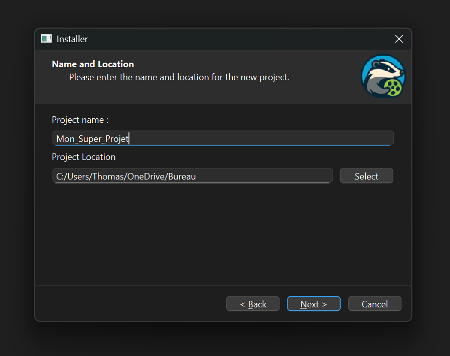{width=500px}
4. Choisissez les options de votre projet. Pour l'instant, il n'y en a pas. Peut-être dans le futur. Cliquez sur le bouton "`Commit`". 
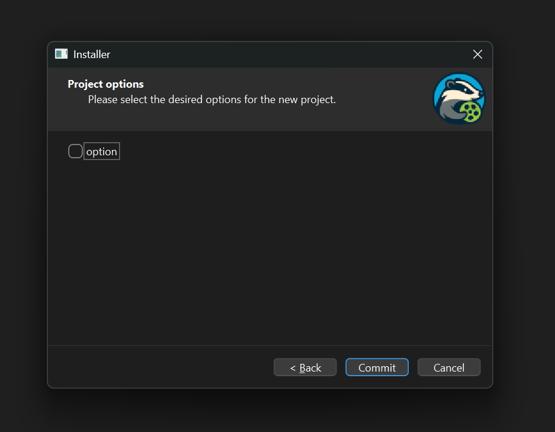{width=500px}
5. Attendez que l'installeur termine la création de votre projet. Le code est telement optimisé que le temps de chargement ne devrait même pas être visible 😎.
    
    A la fin de l'installation, vous devriez voir a la fin du texte "`SUCCESS`" en vert.
    
    Cliquez sur le bouton "`Next`"
     
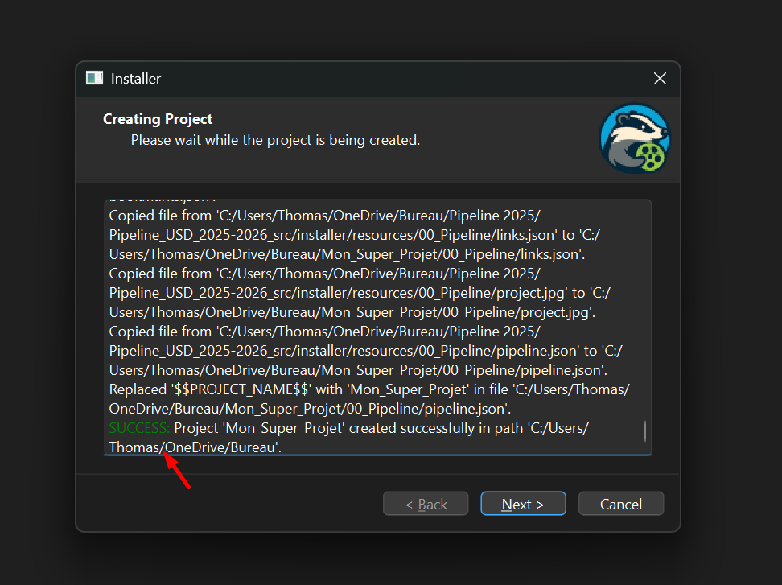{width=500px}

6. Le projet est actuellement créé. Vous pouvez cliquer sur le bouton "`Open the project in explorer`" pour ouvrir le dossier de votre projet dans l'explorateur de fichiers.
    
    Cliquez ensuite sur le bouton "`Finish`" pour fermer l'installeur.
     
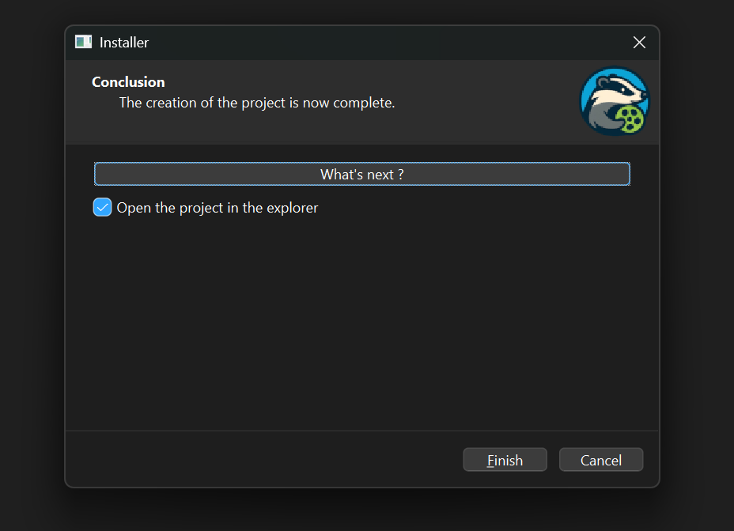{width=500px}

## :material-folder-plus-outline: Comment utiliser un projet déja existant avec Prism?

1. Lancez Prism.
2. Cliquez sur le bouton en haut a droite : 
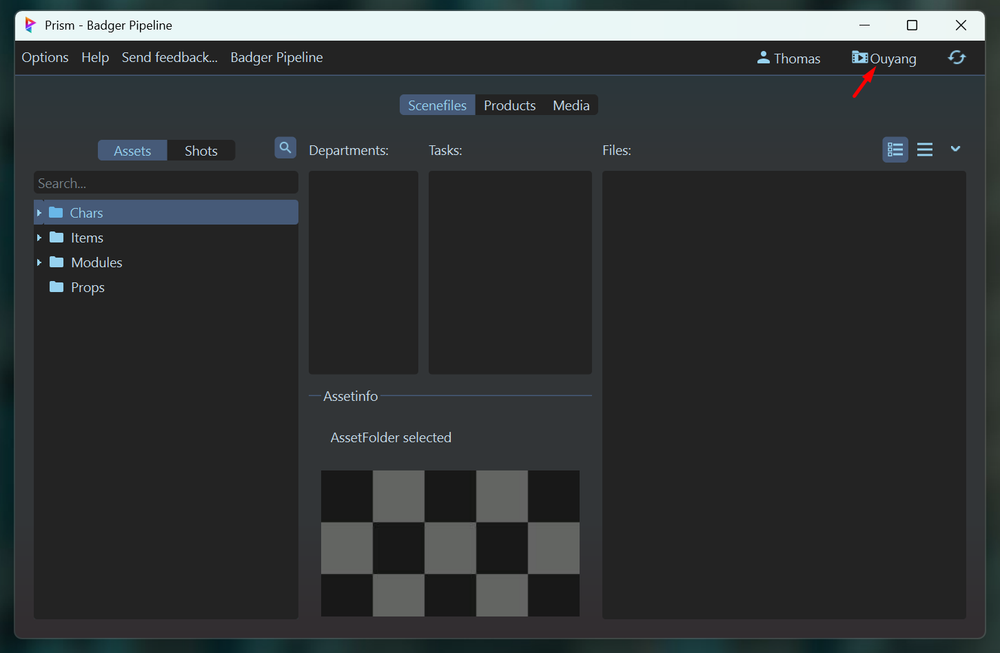{width=500px}

3. Cliquez sur "`Browse`" et choisissez le dossier de votre projet. 
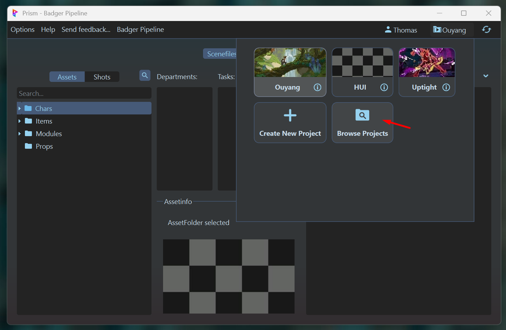{width=500px}

4. Le projet est chargé. Vous pouvez maintenant naviguer dans les assets et les séquences de votre projet. 

## :material-account-multiple-plus-outline: Comment créer un asset ?

1. Dans Prism, rendez-vous dans l'onglet "`Assets`". 
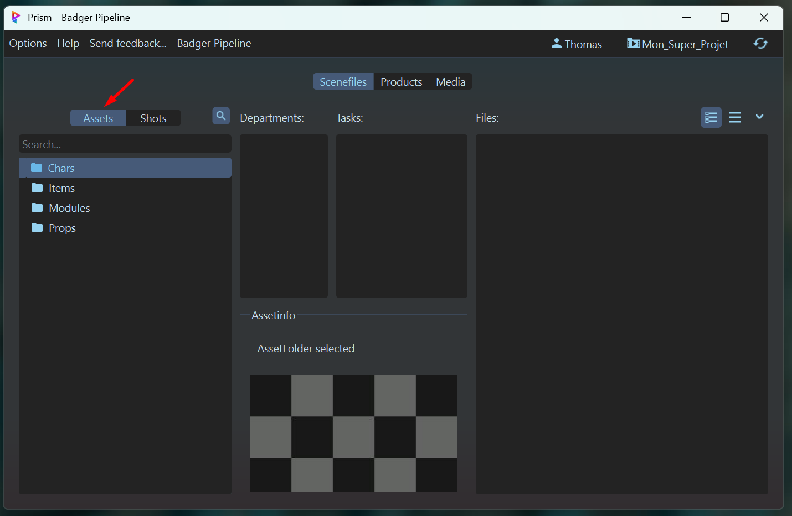{width=500px}
2. Selectionnez un des dossiers déja présents, (ou créez en de nouveaux a l'intérieur d'un dossier existant) puis clic droit et cliquez sur "`Create Asset...`". 
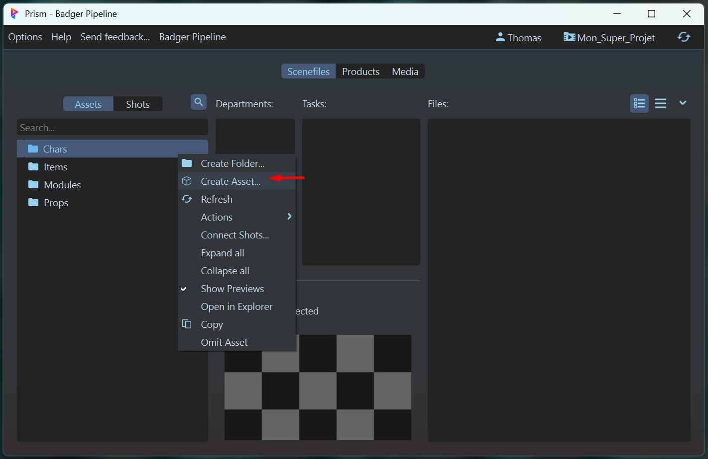{width=500px}
3. Une boite de dialogue s'ouvre :
    - Choisissez un nom pour votre asset.
    - Activez les presets pour l'asset. Cela définiras quel départements seront créés pour cet asset.
    - Choisissez un des presets disponibles, en fonction du type d'asset que vous créez.
    - Vous pouvez donner une description a votre asset, qui sera visible dans prism.
    - Cliquez sur le bouton "`Create`". 
{width=500px}

4. L'asset est créé. Vous pouvez maintenant le sélectionner dans la liste des assets pour voir ses détails, ou faire un clic droit dessus pour ouvrir son dossier dans l'explorateur de fichiers. 

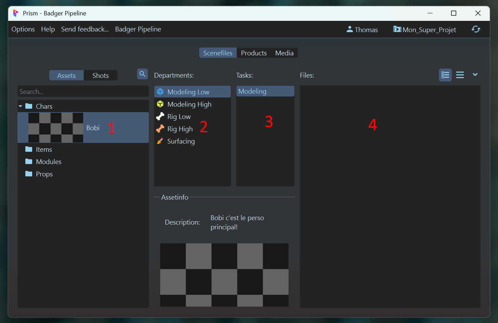{width=500px}

Sur la page principale, vous pouvez voir plusieurs sections :

1. La liste des assets, avec l'asset que l'on viens de créer.
2. La liste des départements. Ces départements ont été créés automatiquement en fonction du preset que l'on a choisi.
3. La liste des taches pour le département sélectionné. Une task est une sous catégorie de travail dans un département. Par exemple, dans le département "Modeling", on peut avoir les tâches "Sculpt", "UVs", etc.
4. Les scènes existantes pour l'asset sélectionné. Par défaut, aucune scène n'est créée automatiquement.
s

## :material-camera-plus-outline: Comment créer une séquence ?

La création d'une séquence est très similaire à la création d'un asset, a quelques détails près puisqu'il nous faut créer **des shots**, ansi qu'un **Master shot**.

1. Dans Prism, rendez-vous dans l'onglet "`Shots`". 
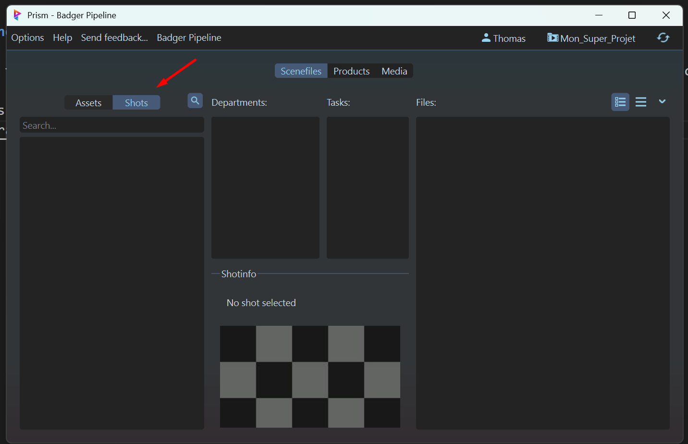{width=500px}

2. Faites clic droit dans la liste des séquences, puis cliquez sur "`Create Shot...`". 
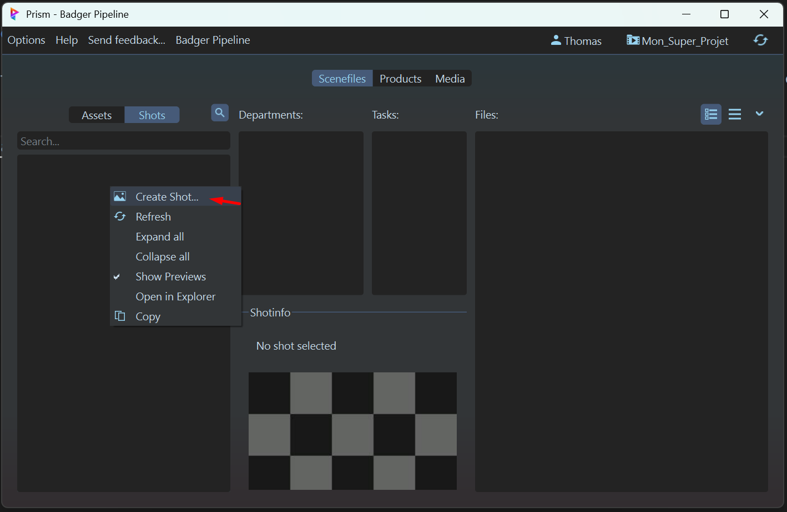{width=500px}

3. Une boite de dialogue s'ouvre :
    - Choisissez un nom pour votre séquence.
    - Choisissez un nom pour votre shot. Dans un premier temps, nous allons créer le Master shot. Appelez le **"Master"** (nomenclature importante ici).
    - Selectionnez le framerange de votre shot. Si c'est un Master, cette valeur n'a pas d'importance, mais pour les autres shots, ce sera important.
    - Activez les presets pour la séquence. Cela définiras quel départements seront créés pour cette séquence.
    - Choisissez un des presets disponibles, en fonction du type de séquence que vous créez. Pour le Master, choisissez le preset **"Master"**.
    - Cliquez sur le bouton "`Create`". 
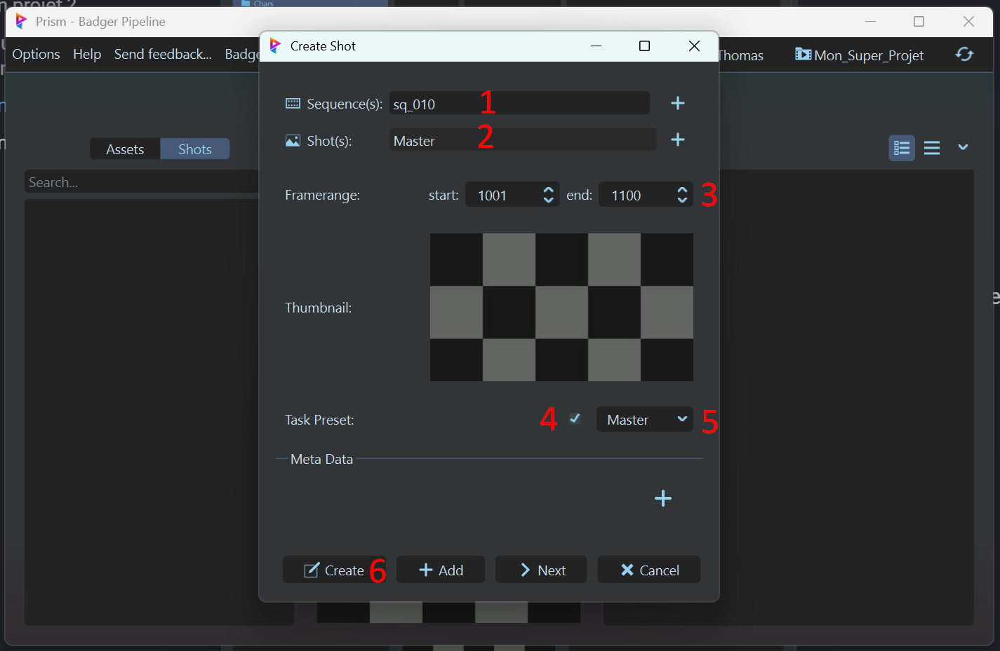{width=500px}

4. La séquence est créée. Vous pouvez maintenant la sélectionner dans la liste des séquences pour voir ses détails, ou faire un clic droit dessus pour ouvrir son dossier dans l'explorateur de fichiers. 
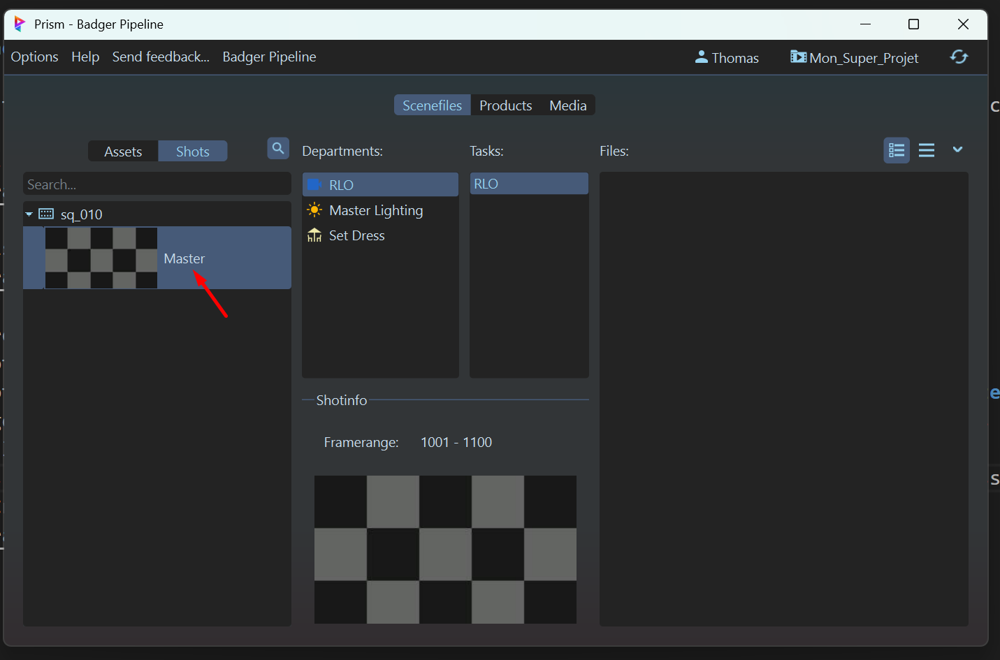{width=500px}

Maintenant, vous pouvez créer des shots pour cette séquence. La procédure est la même que pour créer une séquence, mais avec quelques différences :

1. Faites clic droit sur la séquence dans la liste des séquences, puis cliquez sur "`Create Shot...`". 
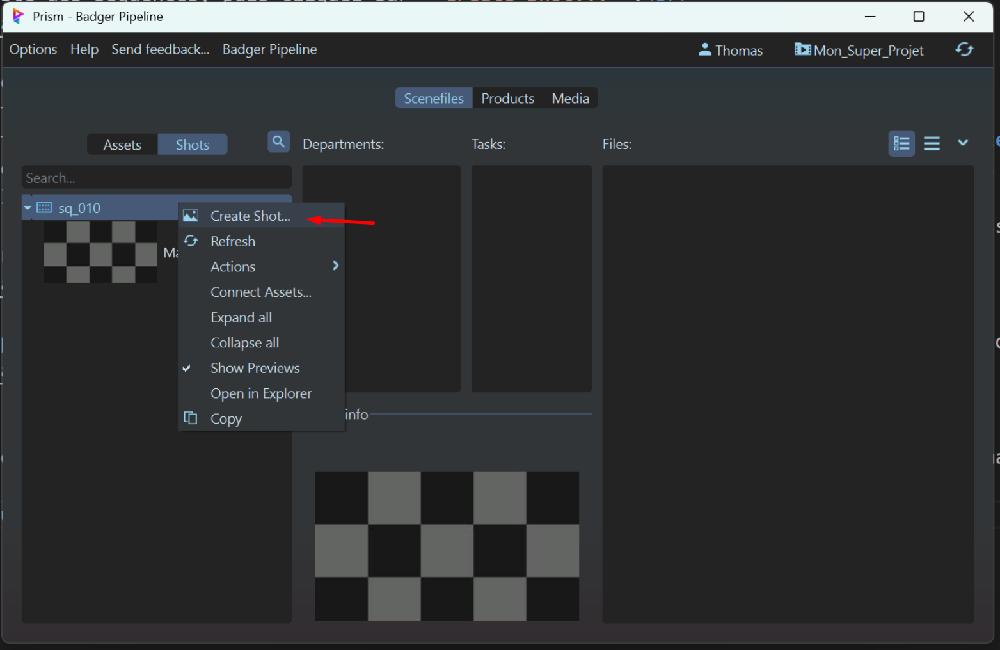{width=500px}
2. Une boite de dialogue s'ouvre :
    - Le nom de la séquence est déjà rempli.
    - Choisissez un nom pour votre shot. Par exemple : **"sh_010"**.
    - Selectionnez le framerange de votre shot. Cette valeur est importante, car elle définira le framerange de travail pour ce shot.
    - Activez les presets pour le shot. Cela définiras quel départements seront créés pour ce shot.
    - Choisissez un des presets disponibles, en fonction du type de séquence que vous créez. Pour un shot classique, choisissez le preset **"Shot"**.
    - Cliquez sur le bouton "`Create`". 
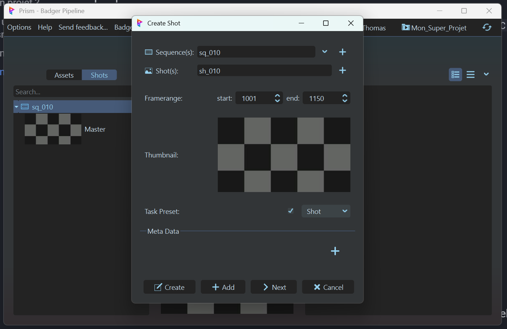{width=500px}

3. Le shot est créé. Vous pouvez maintenant le sélectionner dans la liste des séquences pour voir ses détails, ou faire un clic droit dessus pour ouvrir son dossier dans l'explorateur de fichiers. 
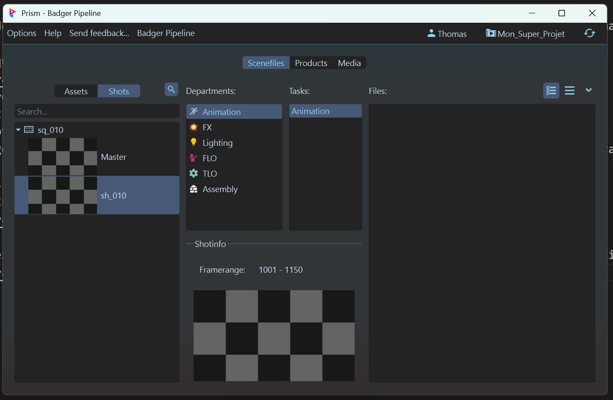{width=500px}

## :material-account-question: Et maintenant ?

Maintenant que vous avez créé un projet, des assets et des séquences, vous pouvez commencer à travailler dessus.

Je vous conseille de lire les documentations concernant les différents départements, pour savoir comment travailler sur chacun d'entre eux.
- [Voir la documentation des départements](../departements/)
