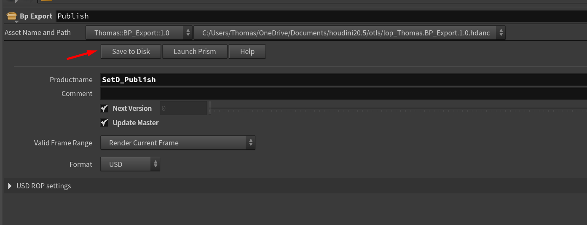

# :material-lightbulb-on-30: Master Lighting (mlght)

{width=40px}
 
==Travail à la séquence==

------

## :material-information-slab-box-outline: Description

Le département `Master Lighting` est responsable de la création de l'éclairage principal et de l'ambiance visuelle d'une séquence. Contrairement au département `Lighting` qui se concentre sur l'éclairage spécifique des personnages et des éléments animés, le Master Lighting établit le cadre global de l'éclairage pour toute la scène. L'artiste doit se concentrer sur la création d'une atmosphère cohérente et immersive qui soutient la narration visuelle de la séquence.

Les lumières créées doivent donc etre réutilisables dans tous les shots.

!!! tip
    Il seras possible de modififier les paramètres des lumières, de désactiver ou d'ajouter des lumières en plus dans le département `Lighting`.

------

## :material-import: Qu'est ce qui rentre ?

Le Master Light se fais directement sur le SetDress de la séquence. Il n'y a pas besoin de personnages, ni de caméras spécifiques.

------

## :material-export: Qu'est ce qui sort ?

Le département Master Lighting génère un fichier `.usd` qui contient les lumières et les réglages d'éclairage pour la séquence. Il ne dois pas référencer le SetDress car celui-ci seras réimporté dans le département `Assembly`.
Ce fichier est ensuite utilisé comme base pour le département `Lighting`, où des ajustements spécifiques peuvent être apportés pour chaque shot individuel.

------

## :material-lightbulb-on-30: Quels sont les nodes que je peux créer ?

Vous  créer nimporte quelle type de lumière disponible dans le `Stage` de Houdini. Par exemple : 
{width=500px}

!!! warning
    Attention a ne pas créer des nodes `Edit` car ils servent a modifier des lights existantes, et dans notre cas il n'y en a pas encore.

------

## {width=30px} Comment créer une scène dans Houdini

1. Assurez-vous d'avoir un département de `Master Lighting` dans votre asset. Si ce n'est pas le cas, créez-en un. 
{width=500px}

2. Créez vous une tache (exemple : `MasterLighting`, ou `MLGHT`). A noter que la nomenclature des taches n'est pas importante pour l'instant, vous pouvez mettre ce que vous voulez. 
{width=500px}

3. Click droit sur la partie 'files' (à droite), puis :  
`Create Template` -> `Lighting` -> `Houdini - Master`, ou simplement sur `Create Template` -> `Auto Houdini` 
{width=500px}

4. Cela devrait ouvrir une boite de dialogue demandant les paramètres de création de la scène.
    - Le "`Import References`" détermine si on importe des assets ou non, dans notre cas il sagit d'un SetDress.
{width=500px}

5. Notez qu'il y'a une seconde page dans ce dialogue : "`Import Products`". C'est la page qui sert à affiner les products qui seront importées dans la scène au cas ou l'algorithme passe à coté de quelque chose. Ici, on vas importer notre setdress.
Lisez la [documentation](https://thomasescalle.github.io/Pipeline_USD_2025/outils/prism_main_pluggin/) pour plus de détails sur cette page. 
{width=500px}

6. Une fois remplie, cliquez sur `Create`.

Cela devrait vous créer un fichier en `.hip`. Double cliquez dessus pour l'ouvrir dans Houdini. 
Dans Houdini navigez dans le contexte `/stage`. Il devrait y avoir une hierarchie déja présente. 

{width=500px}

------

## {width=30px} Ou construire mes lights dans Houdini ?

1. Dans Houdini, rendez vous dans le contexte `stage`. 
{width=500px}

2. A l'interieur, double cliquez sur le node vert `Master_Light` pour entrer à l'intérieur. 
{width=500px}

3. Vous pouvez maintenant construire vos lights à l'intérieur de ce node, à votre guise. 
{width=500px}

4. Il y'a aussi un node vert `Light_Mixer` qui permet de mixer les différents types de lumières. Cliquez dessus pour entrer à l'intérieur. [Voir la documentation du node `Light Mixer`](https://www.sidefx.com/docs/houdini/nodes/lop/lightmixer.html)
 
{width=500px}

-----

## {width=30px} Comment publier une scène dans Houdini

Voir [la documentation sur le node `BP_Publish`](../../outils/houdini_node_bp_export)

1. Dans Houdini, rendez vous dans le contexte `stage`. 
{width=500px}

2. Cliquez sur le node jaune `Publish` pour le sélectionner. 
{width=500px}

3. Cliquez sur le bouton `Save to disk` dans le panneau de droite. 
{width=500px}

 

Vous devriez à présent avoir un product `MLgt_Publish` avec un fichier `.usd` à l'intérieur. 

{width=500px}