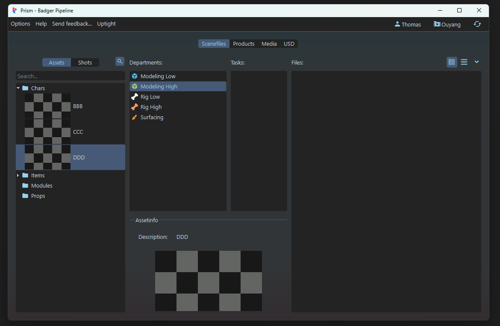
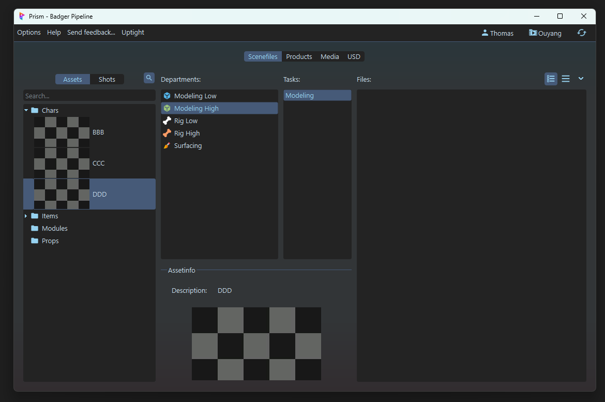
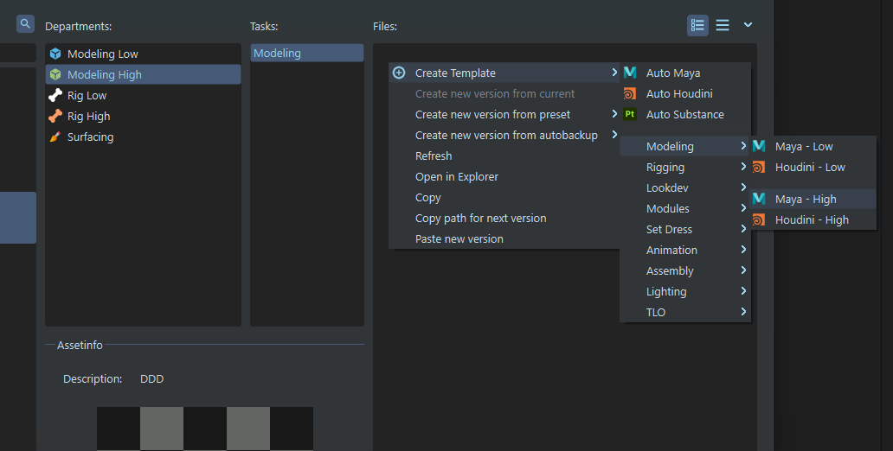
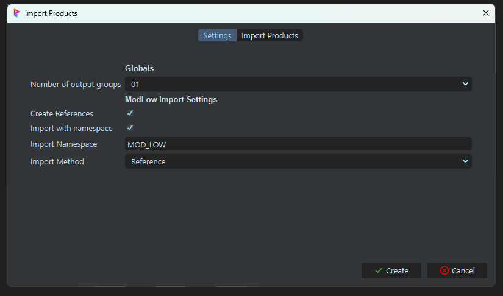
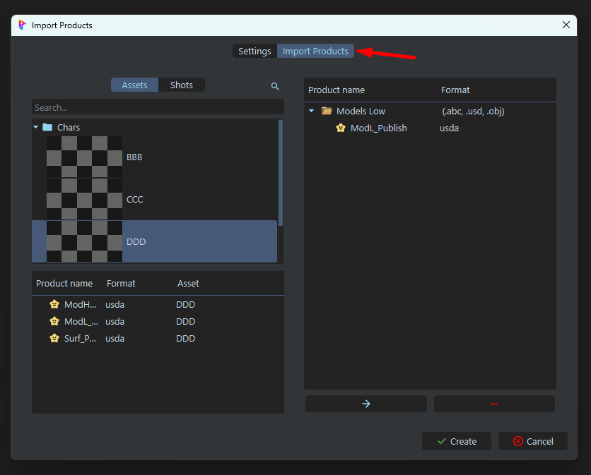

# :material-cube-outline: Modeling High

{width=40px}
{width=40px}
 
==Travail à l'asset==

## :material-information-slab-box-outline: Description

Le Modeling High est le deuxième niveau de modélisation 3D dans le pipeline de production.
Il s'agit des modèles 3D définitifs, affichés à l'écran.

Ces modèles serviront à :

- Produire la géométrie finale utilisée dans le rendu.
- Servir de référence pour le texturing et le shading.
- Être utilisés dans le rigging final et l’animation.

 

## :material-import: Qu'est ce qui rentre ?

Le Modeling High reçoit en entrée le fichier `.usd` produit par le Modeling Low.

## :material-export: Qu'est ce qui sort ?

Le Modeling High sort un fichier de type `.usd`. Il doit contenir la géométrie finale, sans animation ni shading. Dans certains cas, des attributs supplémentaires peuvent être inclus, au besoin de l'asset.

 

## {width=30px} Comment créer une scène dans Maya

1. Assurez-vous d'avoir un département de `Modeling High` dans votre asset. Si ce n'est pas le cas, créez-en un. 
{width=500px}

2. Créez vous une tache (exemple : `modh_01`). A noter que la nomenclature des taches n'est pas importante pour l'instant, vous pouvez mettre ce que vous voulez (UV, Procedural, Modeling, etc.). 
{width=500px}

3. Click droit sur la partie 'files' (à droite), puis :  
`Create Template` -> `Modeling` -> `Maya - High`, ou simplement sur `Create Template` -> `Auto Maya` 
{width=500px}

4. Cela devrait ouvrir une boite de dialogue demandant les paramètres de création de la scène.
    - Le "`Number of output groups`" correspond au nombre d'assets qui sont crées dans la scènes, et donc au nombre de variations qui seront générées.
    - Le "`Create Reference`" détermine si on importe des assets ou non.
    - Le "`Import with namespace`" détermine si les assets importés auront un namespace ou non.
    - Le "`Import namespace`" détermine le namespace à utiliser pour les assets importés (par défaut MOD_LOW).
    - Le "`Import method`" détermine le mode d'importation (par exemple, en référence ou en dur).
{width=500px}

5. Notez qu'il y'a une seconde page dans ce dialogue : "`Import Products`". C'est la page qui sert à affiner les products qui seront importées dans la scène au cas ou l'algorithme passe à coté de quelque chose. Ici, on vas importer nos modeling low comme base pour nos modeling high.
Lisez la [documentation](https://thomasescalle.github.io/Pipeline_USD_2025/outils/prism_main_pluggin/) pour plus de détails sur cette page. 
{width=500px}

6. Cliquez sur le bouton "Create" pour créer la scène.

Cela devrait vous créer un fichier en `.ma`. Double cliquez dessus pour l'ouvrir dans Maya. 
Dans maya, il devrait y avoir une hierarchie déja présente, avec les assets importés correctement.

## {width=30px} Comment publier une scène dans Maya

1. Todo

## {width=30px} Comment créer une scène dans Houdini

1. Todo

## {width=30px} Comment publier une scène dans Houdini

1. Todo

