# :material-cube-outline: Modeling High

{width=40px}
{width=40px}
<br>
==Travail à l'asset==

-----

## :material-information-slab-box-outline: Description

Le Modeling High est le deuxième niveau de modélisation 3D dans le pipeline de production.
Il s'agit des modèles 3D définitifs, affichés à l'écran.

Ces modèles serviront à :

- Produire la géométrie finale utilisée dans le rendu.
- Servir de référence pour le texturing et le shading.
- Être utilisés dans le rigging final et l’animation.

-----

## :material-import: Qu'est ce qui rentre ?

Le Modeling High reçoit éventuellement en entrée le fichier `.usd` produit par le Modeling Low.

-----

## :material-export: Qu'est ce qui sort ?

Le Modeling High sort un fichier de type `.usd`. Il doit contenir la géométrie finale, sans animation ni shading. Dans certains cas, des attributs supplémentaires peuvent être inclus, au besoin de l'asset.

-----

## {width=30px} Comment créer une scène dans Maya


1. Assurez-vous d'avoir un département de `Modeling High` dans votre asset. Si ce n'est pas le cas, créez-en un.<br>
{width=500px}

2. Créez vous une tache (exemple : `modh_01`). A noter que la nomenclature des taches n'est pas importante pour l'instant, vous pouvez mettre ce que vous voulez (UV, Procedural, Modeling, etc.).<br>
{width=500px}

3. Click droit sur la partie 'files' (à droite), puis : <br>
`Create Template` -> `Modeling` -> `Maya - High`, ou simplement sur `Create Template` -> `Auto Maya`<br>
{width=500px}

4. Cela devrait ouvrir une boite de dialogue demandant les paramètres de création de la scène.
    - Le "`Number of output groups`" correspond au nombre d'assets qui sont crées dans la scènes, et donc au nombre de variations qui seront générées.
    - Le "`Create Reference`" détermine si on importe des assets ou non.
    - Le "`Import with namespace`" détermine si les assets importés auront un namespace ou non.
    - Le "`Import namespace`" détermine le namespace à utiliser pour les assets importés (par défaut MOD_LOW).
    - Le "`Import method`" détermine le mode d'importation (par exemple, en référence ou en dur).
{width=500px}

5. Notez qu'il y'a une seconde page dans ce dialogue : "`Import Products`". C'est la page qui sert à affiner les products qui seront importées dans la scène au cas ou l'algorithme passe à coté de quelque chose. Ici, on vas importer nos modeling low comme base pour nos modeling high.
Lisez la [documentation](https://thomasescalle.github.io/Pipeline_USD_2025/outils/prism_main_pluggin/) pour plus de détails sur cette page.<br>
{width=500px}

6. Cliquez sur le bouton "Create" pour créer la scène.

Cela devrait vous créer un fichier en `.ma`. Double cliquez dessus pour l'ouvrir dans Maya.<br>
Dans maya, il devrait y avoir une hierarchie déja présente, avec les assets importés correctement.

-----

## {width=30px} Comment la scène est t'elle crée automatiquement ?

La scène crée contiens simplement des groupes vides a la racine, avec des noms spécifiques en fonction de leurs numéros de variation.<br>
```
<item_type>_<assetName>_modh_grp[_var001]
```

De plus des assets sont importées automatiquement :

- Le `Modeling Low` de l'asset courant. L'algorythme recherche les modeling low publié, dont le format est en `.usd`, en `.usda`, en `.usdc`, en `.abc` ou en `.obj`. Si il en trouve plusieurs (comme avec des variants), il les prends tous et les importe. Il detecte les Modeling Low en cherchant les assets qui contiennent a la fois "`ModL`" et "`Publish`" dans leur nom. Il est possible d'ajuster cette selection dans la fenetre de création de la scène, dans l'onglet "`Import Products`".


-----

## {width=30px} Comment publier une scène dans Maya

1. Une fois votre modélisation terminée, assurez-vous tout est propre, sans problèmes dans la géometrie (faire un `Mesh Cleanup` si besoin).<br>

2. Assurez-vous que tous les objets soit bien hièrarchisés, et bien groupés dans le groupe `[département]_[nom]_modh_grp`.<br>
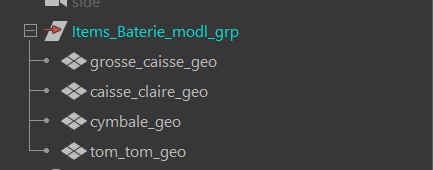{width=500px}

3. Selectionnez le groupe `[département]_[nom]_modh_low` dans l'outliner.

4. Ouvrez la fenêtre du pipeline de production et cliquez sur le bouton `Publish`.<br>
{width=500px}

5. Une premiere boite de dialogue s'ouvre pour vous demander sous quel variant exporter l'asset. <br>
Si vous laisser "default", l'asset seras exporté sous le nom "`ModH_Publish`". Si vous mettez un numéro, l'asset sera exporté sous le nom "`ModH_Publish_var[numéro]`".
Cela servira plus tard pour créer les differentes variations de l'asset. <br>
Voir [qu'est ce qu'un variant en USD](https://thomasescalle.github.io/Pipeline_USD_2025/qanda/#quest-ce-quun-variant-en-usd)<br>
Une fois terminé, cliquez sur `OK`, ou `Annuler` si vous souhaitez annuler l'export.<br>
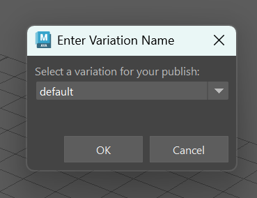{width=500px}

6. Une seconde fenêtre s'ouvre, verifiez bien que le champ `Output Type` est bien sur `usd`, et que le champ `object` est bien sur le groupe a publier.<br>

7. Cliquez sur le bouton `Add Selected` <br>

8. Cliquez sur le bouton `Export` pour publier votre fichier.<br>
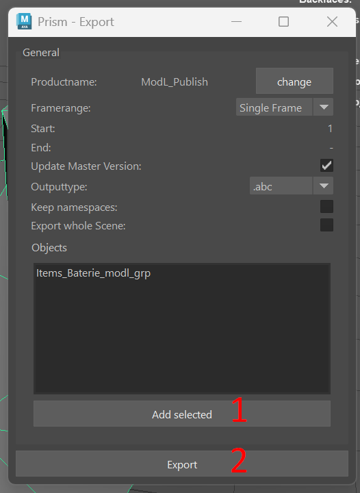{width=500px}
8. Vous devriez voir un message de **succès** qui s'affiche. Le modeling est maintenant publié et automatiquement appliqué a l'asset USD.

-----


## {width=30px} Comment créer une scène dans Houdini

1. Assurez-vous d'avoir un département de `Modeling High` dans votre asset. Si ce n'est pas le cas, créez-en un.<br>
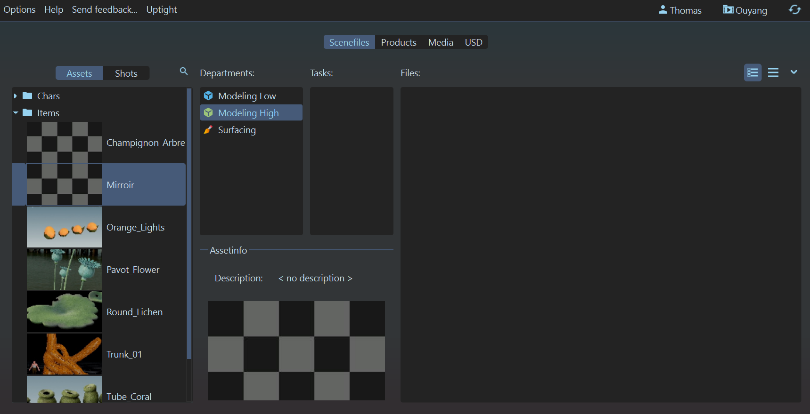{width=500px}

2. Créez vous une tache (exemple : `Modeling`, ou `Modeling_procedural`). A noter que la nomenclature des taches n'est pas importante pour l'instant, vous pouvez mettre ce que vous voulez (UV, Procedural, Modeling, etc.).<br>
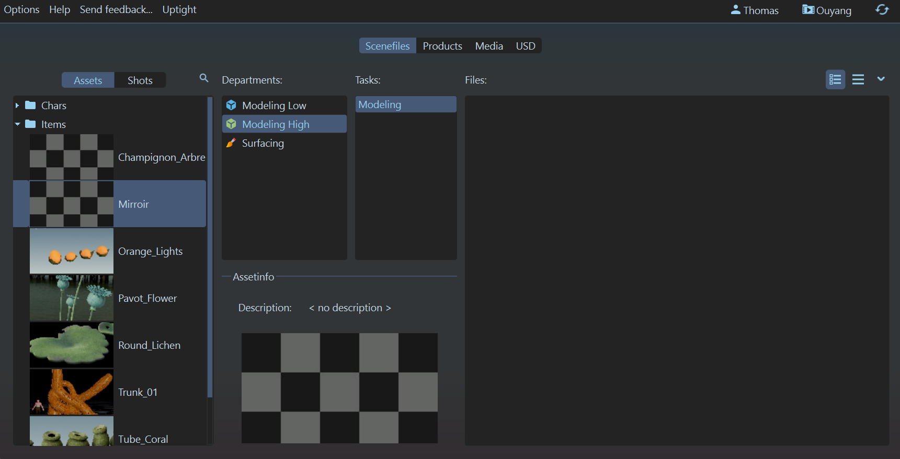{width=500px}

3. Click droit sur la partie 'files' (à droite), puis : <br>
`Create Template` -> `Modeling` -> `Houdini - High`, ou simplement sur `Create Template` -> `Auto Houdini`<br>
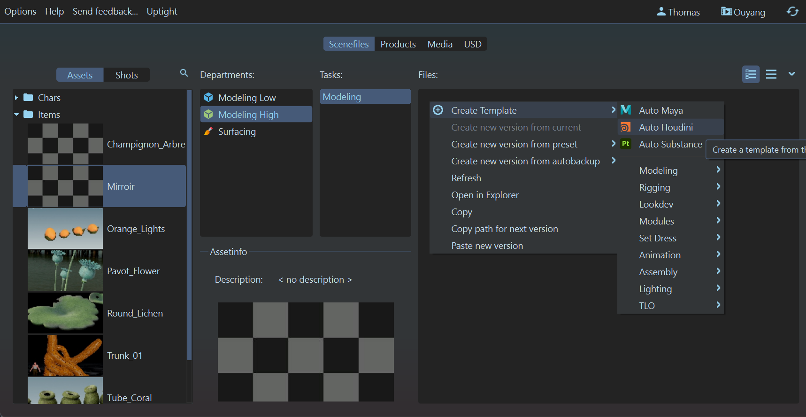{width=500px}

4. Cela devrait ouvrir une boite de dialogue demandant les paramètres de création de la scène.
    - Le "`Creation Method`" détermine si le nombre d'asset a créer dépends du nombre d'assets a importer, ou si on crée un nombre fixe d'assets grace au paramètre "Number of output groups".
    - Le "`Number of output groups`" correspond au nombre d'assets qui sont crées dans la scènes, et donc au nombre de variations qui seront générées.
    - Le "`Import References`" détermine si on importe des assets ou non.
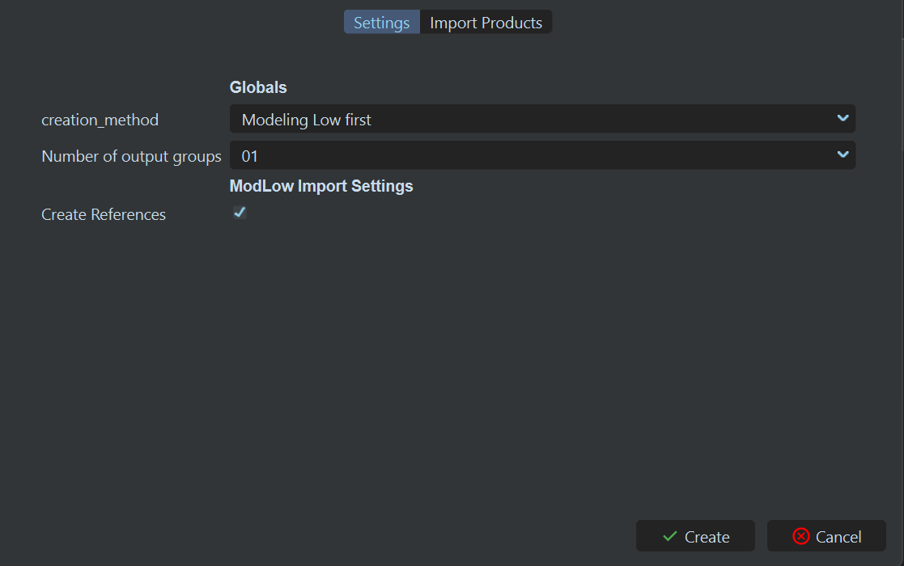{width=500px}

5. Notez qu'il y'a une seconde page dans ce dialogue : "`Import Products`". C'est la page qui sert à affiner les products qui seront importées dans la scène au cas ou l'algorithme passe à coté de quelque chose. Ici, on vas importer nos modeling low comme base pour nos modeling high.
Lisez la [documentation](https://thomasescalle.github.io/Pipeline_USD_2025/outils/prism_main_pluggin/) pour plus de détails sur cette page.<br>
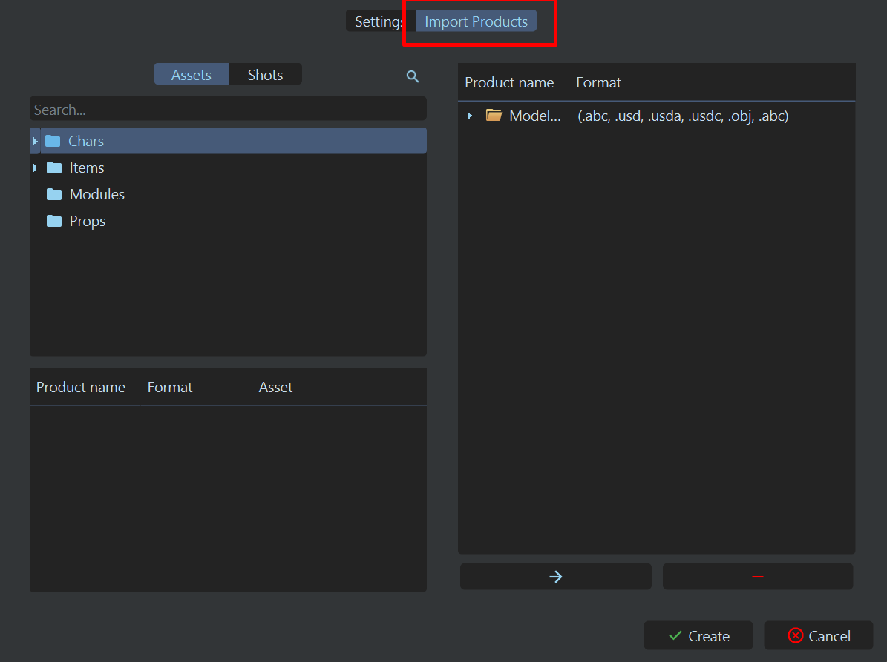{width=500px}

6. Une fois remplie, cliquez sur `Create`.

Cela devrait vous créer un fichier en `.hip`. Double cliquez dessus pour l'ouvrir dans Houdini.<br>
Dans Houdini, il devrait y avoir une hierarchie déja présente. Chaque node "geo" correspond à une variation de l'asset.<br>

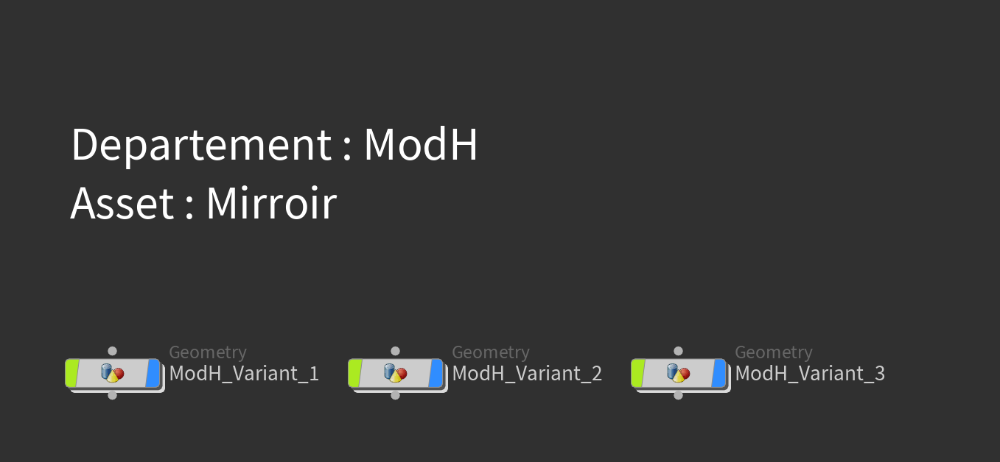{width=500px}

-----


## {width=30px} Comment la scène est t'elle crée automatiquement ?

La scène crée contiens contiens des nodes "geo" a la racine, pour chaque variation de l'asset.<br>

De plus des assets sont importées automatiquement :
- Le `Modeling Low` de l'asset courant. L'algorythme recherche les modeling low publié, dont le format est en `.usd`, en `.usda`, en `.usdc`, en `.abc` ou en `.obj`. Si il en trouve plusieurs (comme avec des variants), il les prends tous et les importe. Il detecte les Modeling Low en cherchant les assets qui contiennent a la fois "`ModL`" et "`Publish`" dans leur nom. Il est possible d'ajuster cette selection dans la fenetre de création de la scène, dans l'onglet "`Import Products`".

-----

## {width=30px} Ou construire la géo dans Houdini ?

1. Dans Houdini, double cliquez dans un des nodes "Geo" qui se trouvent au root de la scène.<br>
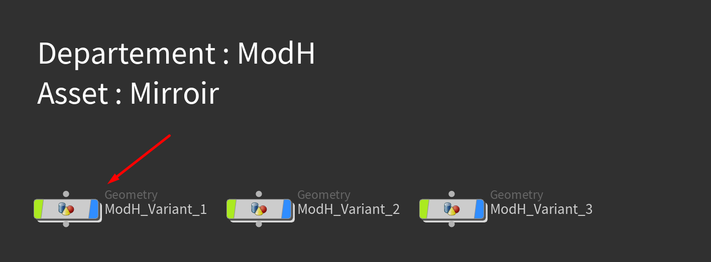{width=500px}

2. A l'interieur, double cliquez sur le node "ModH".<br>
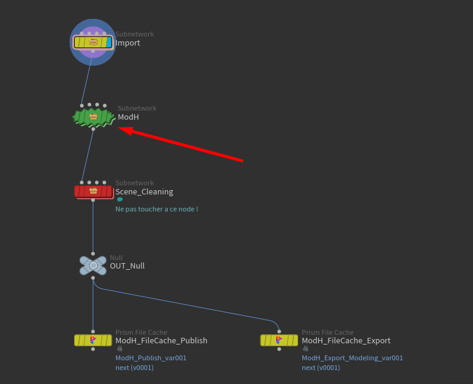{width=500px}

3. Vous pouvez maintenant construire la géométrie de votre asset à l'intérieur de ce node, à votre guise.<br>
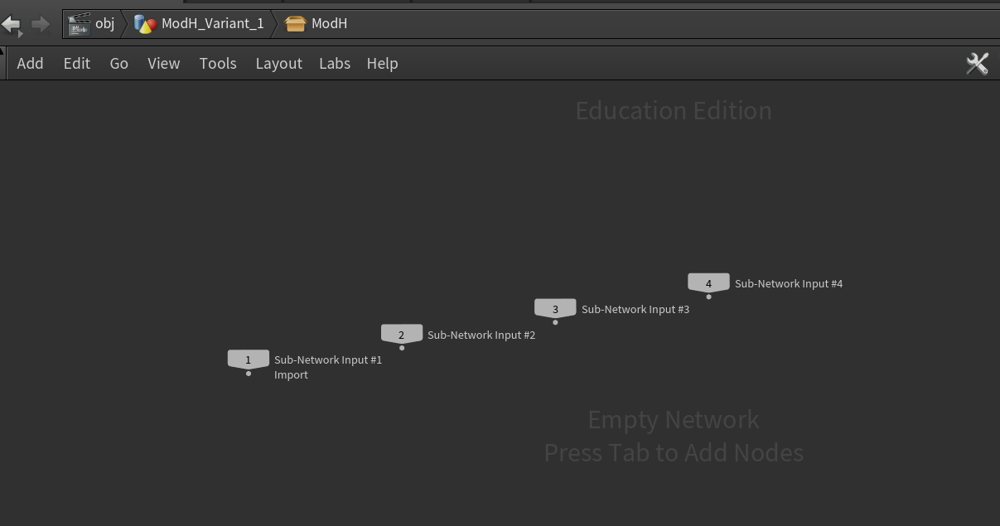{width=500px}

-----

## {width=30px} Comment publier une scène dans Houdini ?

1. Rendez vous à l'intérieur d'un node "Geo" qui se trouve au root de la scène.

2. Cliquez sur le node "`ModH_FileCache_Publish`" (ou sur le node "`ModH_FileCache_Export`" si vous voulez faire un export).<br>
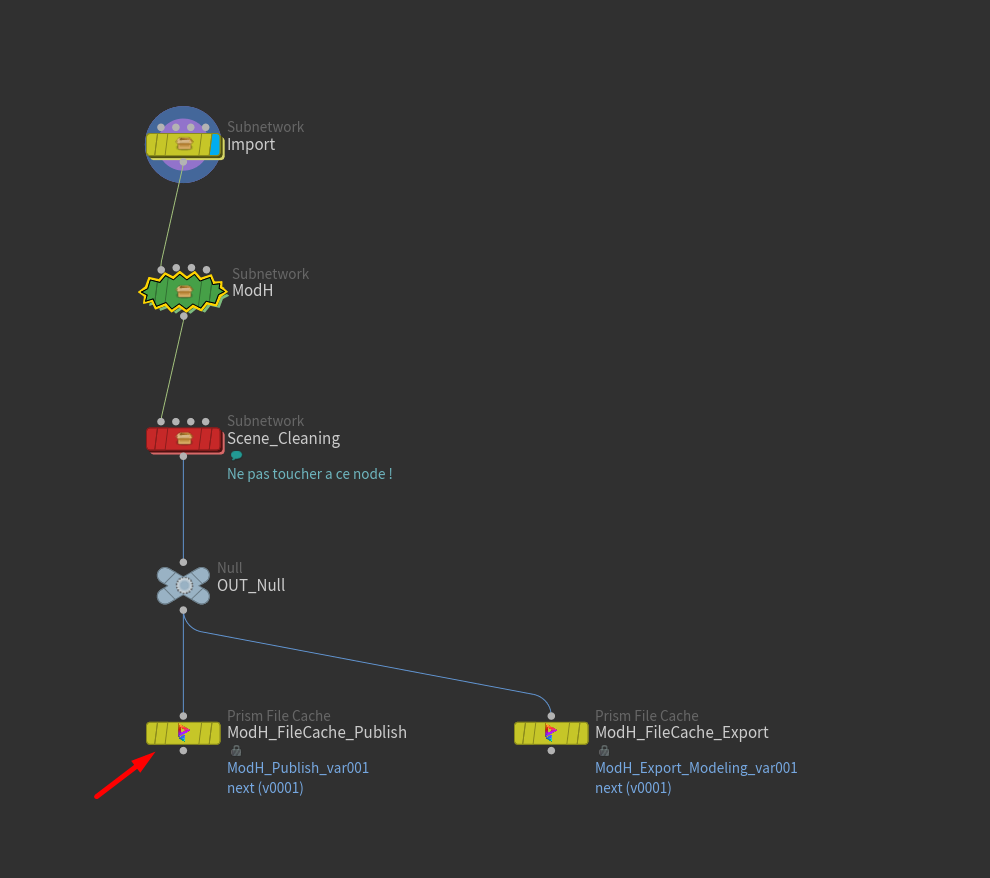{width=500px}

3. Le node devrait être pré-configuré avec les bons paramètres d'export. Cliquez sur `Save to Disk` pour publier.
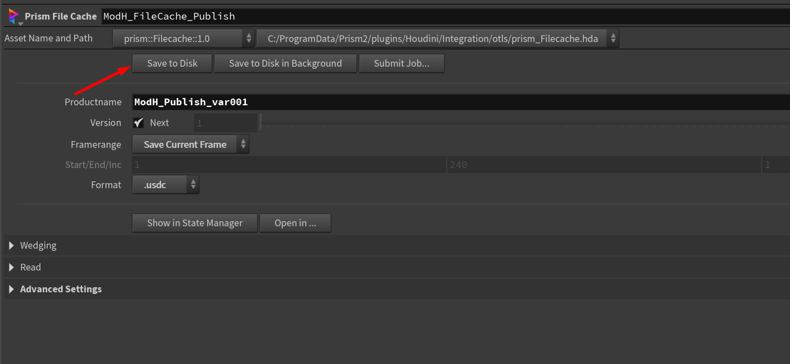{width=500px}