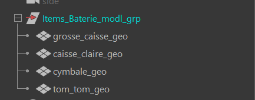
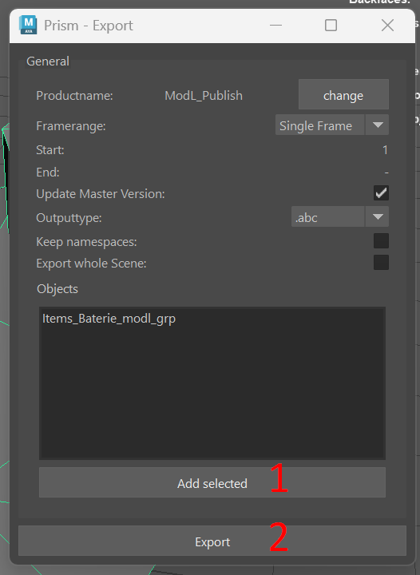

# :material-cube: Modeling Low

{width=40px}
{width=40px}
 
==Travail à l'asset==

## :material-information-slab-box-outline: Description

Le `Modeling Low` est le premier niveau de modélisation 3D et constitue également la première étape du pipeline de production. Il consiste à créer des modèles 3D basiques, souvent à partir de formes géométriques simples. Ces modèles serviront de proxys pour les différentes étapes de la production.

Ces modèles seront utilisés pour :

- La visualisation proxy dans le viewport.
- Servir de base pour la modélisation High.
- Servir de base pour le rigging Low, qui sera ensuite utilisé pour le Rough Layout.

 
---
## :material-import: Qu'est ce qui rentre ?

Il n'y a aucun département qui rentre dans le `Modeling Low`. Il s'agit du premier niveau du pipeline de production.

## :material-export: Qu'est ce qui sort ?

Le `Modeling Low` sort un fichier de type `.abc`. Il ne doit pas y avoir d'animation, ou de shading dans ce fichier.

 

## {width=30px} Comment créer une scène dans Maya

1. Assurez-vous d'avoir un département de `Modeling Low` dans votre asset. Si ce n'est pas le cas, créez-en un. 
{width=500px}

2. Créez vous une tache (exemple : `modl_01`). A noter que la nomenclature des taches n'est pas importante pour l'instant, vous pouvez mettre ce que vous voulez (UV, Procedural, Modeling, etc.). 
{width=500px}

3. Click droit sur la partie 'files' (à droite), puis :  
`Create Template` -> `Modeling` -> `Maya - Low` 
{width=500px}

Cela devrait vous créer un fichier en `.ma`. Double cliquez dessus pour l'ouvrir dans Maya. 
Dans maya, il devrait y avoir une hierarchie déja présente.

## {width=30px} Comment publier une scène dans Maya

1. Une fois votre modélisation terminée, assurez-vous tout est propre, sans problèmes dans la géometrie (faire un `Mesh Cleanup` si besoin). 
2. Assurez-vous que tous les objets soit bien hièrarchisés, et bien groupés dans le groupe `[département]_[nom]_modl_low`. 
{width=500px}
3. Selectionnez le groupe `[département]_[nom]_modl_low` dans l'outliner.
4. Ouvrez la fenêtre du pipeline de production et cliquez sur le bouton `Publish`. 
{width=500px}
5. Une fenêtre s'ouvre, verifiez bien que le champ `Output Type` est bien sur `abc`, et que le champ `object` est bien sur le groupe a publier. 
6. Cliquez sur le bouton `Add Selected`  
7. Cliquez sur le bouton `Publish` pour publier votre fichier. 
{width=500px}
8. Vous devriez voir un message de succès qui s'affiche. Le modeling est maintenant publié et automatiquement appliqué a l'asset USD.

## {width=30px} Comment créer une scène dans Houdini

Cette fonctionnalité n'est pas encore implémentée dans Houdini.

## 