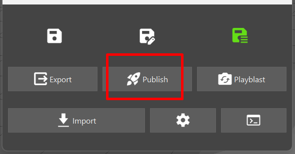

# :material-cube: Modeling Low

{width=40px}
{width=40px}
 
==Travail à l'asset==

-----

## :material-information-slab-box-outline: Description

Le `Modeling Low` est le premier niveau de modélisation 3D et constitue également la première étape du pipeline de production. Il consiste à créer des modèles 3D basiques, souvent à partir de formes géométriques simples. Ces modèles serviront de proxys pour les différentes étapes de la production.

Ces modèles seront utilisés pour :

- La visualisation proxy dans le viewport.
- Servir de base pour la modélisation High.
- Servir de base pour le rigging Low, qui sera ensuite utilisé pour le Rough Layout.
    
-----

## :material-import: Qu'est ce qui rentre ?

Il n'y a aucun département qui rentre dans le `Modeling Low`. Il s'agit du premier niveau du pipeline de production.

-----

## :material-export: Qu'est ce qui sort ?

Le `Modeling Low` sort un fichier de type `.usd`. Il ne doit pas y avoir d'animation, ou de shading dans ce fichier.

-----

## {width=30px} Comment créer une scène dans Maya

1. Assurez-vous d'avoir un département de `Modeling Low` dans votre asset. Si ce n'est pas le cas, créez-en un. 
{width=500px}

2. Créez vous une tache (exemple : `modl_01`). A noter que la nomenclature des taches n'est pas importante pour l'instant, vous pouvez mettre ce que vous voulez (UV, Procedural, Modeling, etc.). 
{width=500px}

3. Click droit sur la partie 'files' (à droite), puis :  
`Create Template` -> `Modeling` -> `Maya - Low`, ou simplemente sur `Create Template` -> `Auto Maya` 
{width=500px}

4. Cela devrait ouvrir une boite de dialogue demandant les paramètres de création de la scène.
    - Le "Number of output groups" correspond au nombre d'assets qui sont crées dans la scènes, et donc au nombre de variations qui seront générées. 
{width=500px}

5. Une fois remplie, cliquez sur `Create`.

Cela devrait vous créer un fichier en `.ma`. Double cliquez dessus pour l'ouvrir dans Maya. 
Dans maya, il devrait y avoir une hierarchie déja présente.

-----

## {width=30px} Comment publier une scène dans Maya

1. Une fois votre modélisation terminée, assurez-vous tout est propre, sans problèmes (faire un cleanup si nécessaire). 

2. Assurez-vous que tous les objets soit bien hièrarchisés, et bien groupés dans le groupe `[département]_[nom]_modl_grp`. 
{width=500px}

3. Selectionnez le groupe `[département]_[nom]_modl_grp` dans l'outliner.

4. Ouvrez la fenêtre du pipeline de production et cliquez sur le bouton `Publish`. 
{width=500px}

5. Une premiere boite de dialogue s'ouvre pour vous demander sous quel variant exporter l'asset.  
Si vous laisser "default", l'asset seras exporté sous le nom "`ModL_Publish`". Si vous mettez un numéro, l'asset sera exporté sous le nom "`ModL_Publish_var[numéro]`".
Cela servira plus tard pour créer les differentes variations de l'asset.  
Voir [qu'est ce qu'un variant en USD](https://thomasescalle.github.io/Pipeline_USD_2025/qanda/#quest-ce-quun-variant-en-usd) 
Une fois terminé, cliquez sur `OK`, ou `Annuler` si vous souhaitez annuler l'export. 
{width=500px}

6. Une seconde fenêtre s'ouvre, verifiez bien que le champ `Output Type` est bien sur `usd`, et que le champ `object` est bien sur le groupe a publier. 

7. Cliquez sur le bouton `Add Selected`  

8. Cliquez sur le bouton `Export` pour publier votre fichier. 
{width=500px}
8. Vous devriez voir un message de succès qui s'affiche. Le modeling est maintenant publié et automatiquement appliqué a l'asset USD.

-----

## {width=30px} Comment créer une scène dans Houdini

1. Assurez-vous d'avoir un département de `Modeling Low` dans votre asset. Si ce n'est pas le cas, créez-en un. 
{width=500px}

2. Créez vous une tache (exemple : `modl_01`). A noter que la nomenclature des taches n'est pas importante pour l'instant, vous pouvez mettre ce que vous voulez (UV, Procedural, Modeling, etc.). 
{width=500px}

3. Click droit sur la partie 'files' (à droite), puis :  
`Create Template` -> `Modeling` -> `Houdini - Low`, ou simplemente sur `Create Template` -> `Auto Houdini` 
{width=500px}

4. Cela devrait ouvrir une boite de dialogue demandant les paramètres de création de la scène.
    - Le "Number of output groups" correspond au nombre d'assets qui sont crées dans la scènes, et donc au nombre de variations qui seront générées. 
{width=500px}

5. Une fois remplie, cliquez sur `Create`.

Cela devrait vous créer un fichier en `.hip`. Double cliquez dessus pour l'ouvrir dans Houdini. 
Dans Houdini, il devrait y avoir une hierarchie déja présente. Chaque node "geo" correspond à une variation de l'asset. 

{width=500px}

-----

## {width=30px} Ou construire la géo dans Houdini ?

1. Dans Houdini, double cliquez dans un des nodes "Geo" qui se trouvent au root de la scène. 
{width=500px}

2. A l'interieur, double cliquez sur le node "ModL". 
{width=500px}

3. Vous pouvez maintenant construire la géométrie de votre asset à l'intérieur de ce node, à votre guise. 
{width=500px}

-----

## {width=30px} Comment publier une scène dans Houdini ?

1. Rendez vous à l'intérieur d'un node "Geo" qui se trouve au root de la scène.

2. Cliquez sur le node "`ModL_FileCache_Publish`" (ou sur le node "`ModL_FileCache_Export`" si vous voulez faire un export). 
{width=500px}

3. Le node devrait être pré-configuré avec les bons paramètres d'export. Cliquez sur `Save to Disk` pour publier.
{width=500px}