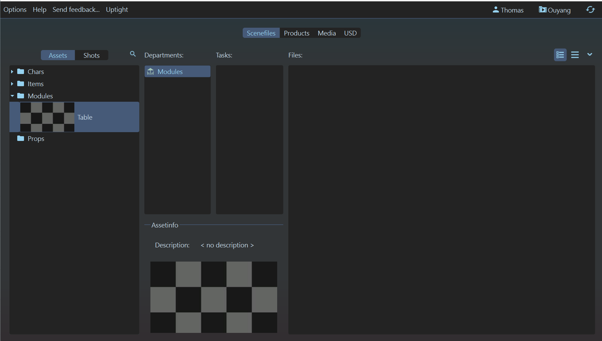
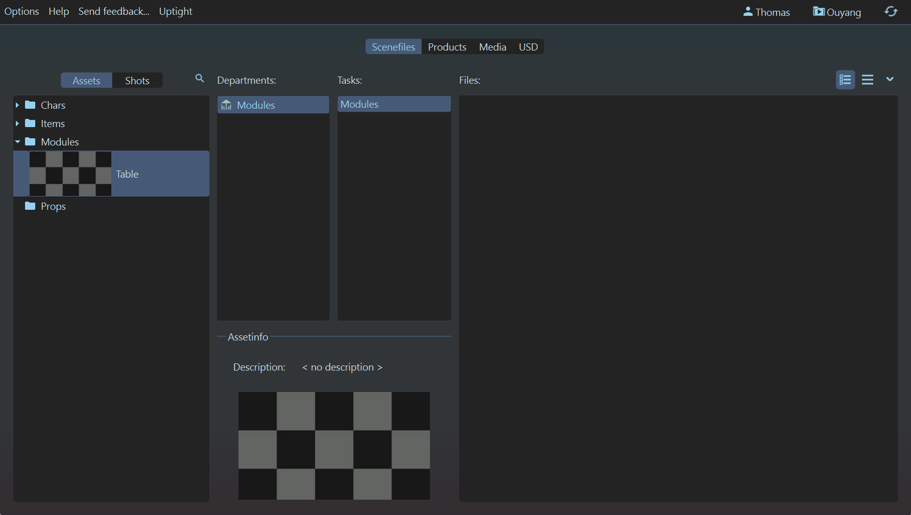
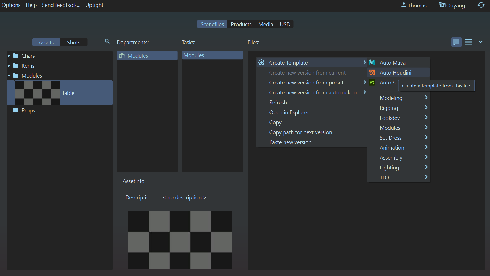
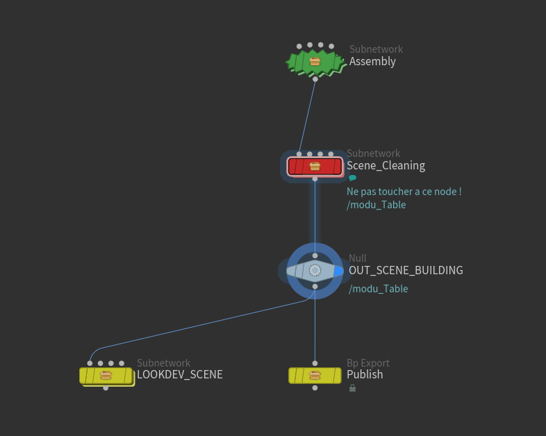
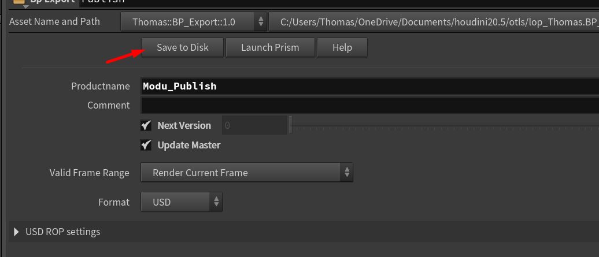

# :material-table: Modules

{width=40px}
 
==Travail à l'asset==

------

## :material-information-slab-box-outline: Description

Le département `Modules` est chargé de créer des assemblages d’éléments réutilisables. Un module correspond à un groupe d’items au format USD, principalement utilisés pour composer des décors ou des accessoires. Un module ne doit pas contenir d’assets animés (comme des personnages, créatures ou véhicules), mais peut inclure des assets statiques (décors, accessoires, etc.) ou même d’autres modules.

Un exemple de module pourrait être, par exemple, un bureau composé de plusieurs assets tels qu'une table, une chaise, un ordinateur, une lampe, etc. Chaque élément est un asset distinct, mais ensemble ils forment un module réutilisable.

On peut considérer un module comme une liste de références vers des fichiers `.usd`. Il est donc très léger.

Il est à différencier du `SetDress`, qui correspond à l'assemblage final d'une scène pour une séquence. Cependant, le fonctionnement est en grande partie similaire.

Les modules sont donc utilisées :

- Pour composer d'autres Modules
- Pour composer des SetDress

-----

## :material-import: Qu'est ce qui rentre ?

Un module peut recevoir en entrée plusieurs fichiers `.usd` représentant les éléments à assembler. Cependant, aucun asset n'est importé par défaut par l'algorithme de création de scène. Il est de la responsabilité de l'artiste de sélectionner et d'importer les assets nécessaires pour composer le module.

-----

## :material-export: Qu'est ce qui sort ?

Un module génère un fichier `.usd` qui référence tous les assets importés et organisés par l'artiste.

------

## {width=30px} Comment créer une scène dans Houdini

1. Assurez-vous d'avoir un département de `Modules` dans votre asset. Si ce n'est pas le cas, créez-en un. 
{width=500px}

2. Créez vous une tache (exemple : `Modules`). A noter que la nomenclature des taches n'est pas importante pour l'instant, vous pouvez mettre ce que vous voulez. 
{width=500px}

3. Click droit sur la partie 'files' (à droite), puis :  
`Create Template` -> `Modules` -> `Houdini`, ou simplement sur `Create Template` -> `Auto Houdini` 
{width=500px}

Cela devrait vous créer un fichier en `.hip`. Double cliquez dessus pour l'ouvrir dans Houdini. 
Dans Houdini, il devrait y avoir une hierarchie déja présente. Rendez vous dans le contexte `stage` pour accéder à la scène. 

{width=500px}

-----

## {width=30px} Comment la scène est t'elle crée ?

La scène créée ne contient pas d'assets importés par défaut. Il est de la responsabilité de l'artiste de sélectionner et d'importer les assets nécessaires pour composer le module.

Elle ne contient que le nécessaire pour créer un module, le nettoyer, et le publier / exporter.

Le nettoyage du module consiste uniquement à grouper les éléments ensemble sous un groupe parent. Il n'est donc pas nécessaire de trop se soucier de la hiérarchie au moment du placement des assets.

-----

## {width=30px} Ou construire le module dans Houdini ?

1. Dans Houdini, rendez vous dans le contexte `stage`. 
{width=500px}

2. A l'interieur, double cliquez sur le node vert `Assembly` pour entrer à l'intérieur. 
{width=500px}

3. Vous pouvez maintenant construire votre module à l'intérieur de ce node, à votre guise. 
{width=500px}

-----

## {width=30px} Comment importer des assets dans la scène de modules ?

Pour importer des assets dans la scène de modules, utilisez le `Bp Asset Browser` que vous trouverez dans le menu `Windows` de Houdini.

Voir [la documentation du Bp Asset Browser](../../outils/houdini_window_bp_asset_browser) pour plus de détails.

Il vous suffit de double cliquer sur un asset pour l'importer dans la scène. Vous pouvez ensuite le déplacer, le faire pivoter, et le redimensionner selon vos besoins.

------

## {width=30px} Comment publier une scène dans Houdini

Voir [la documentation sur le node `BP_Publish`](../../outils/houdini_node_bp_export)

1. Dans Houdini, rendez vous dans le contexte `stage`. 
{width=500px}

2. Cliquez sur le node jaune `Publish` pour le sélectionner. 
{width=500px}

3. Cliquez sur le bouton `Save to disk` dans le panneau de droite. 
{width=500px}
