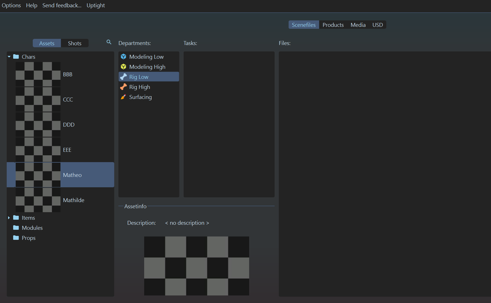
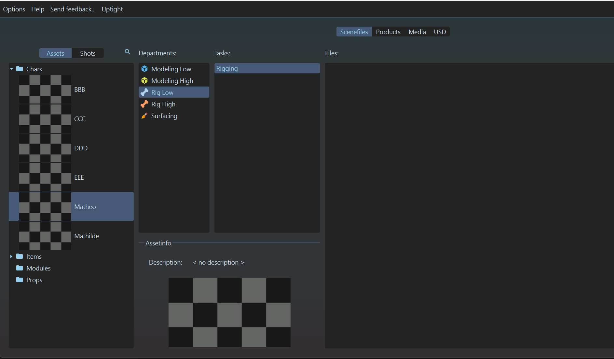
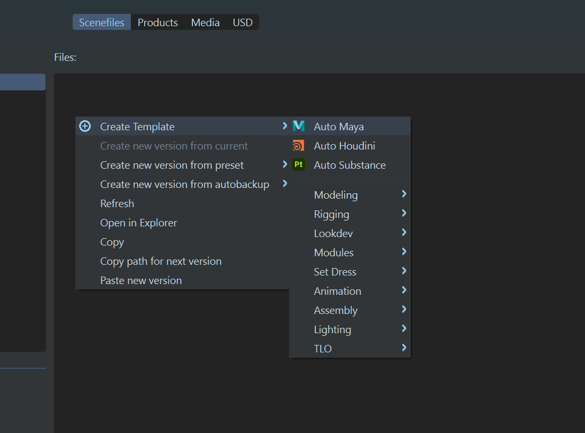
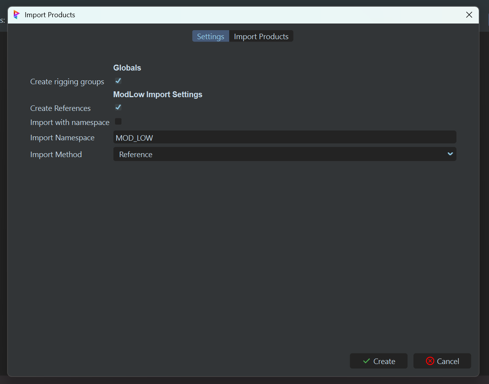
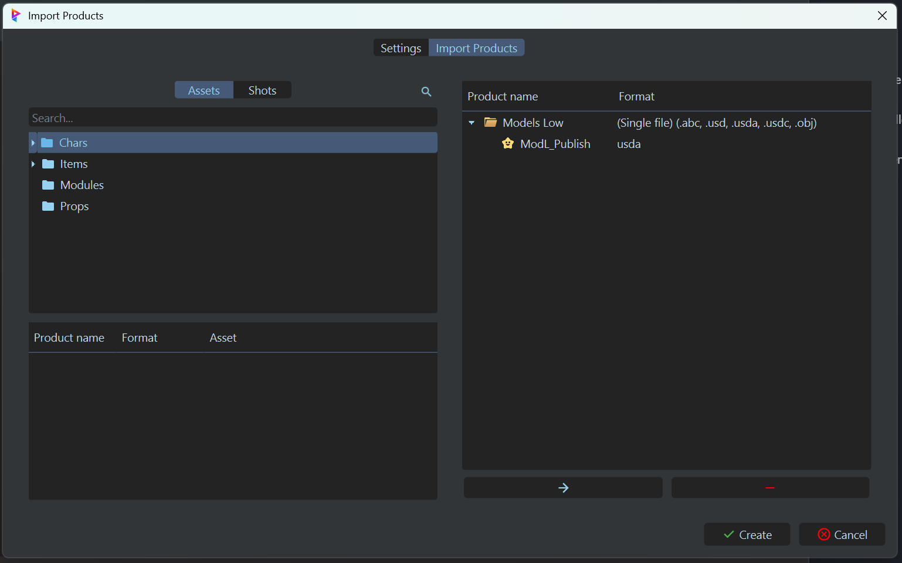
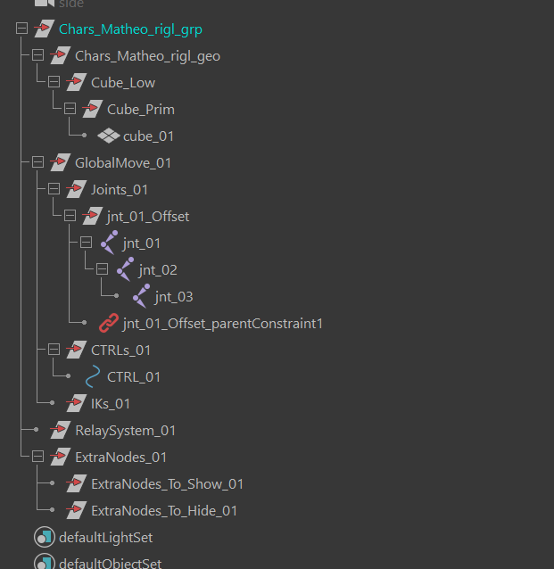
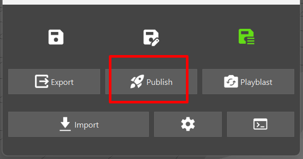
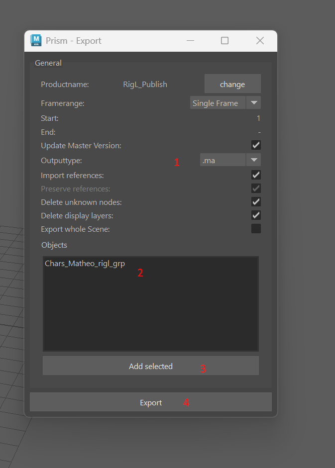
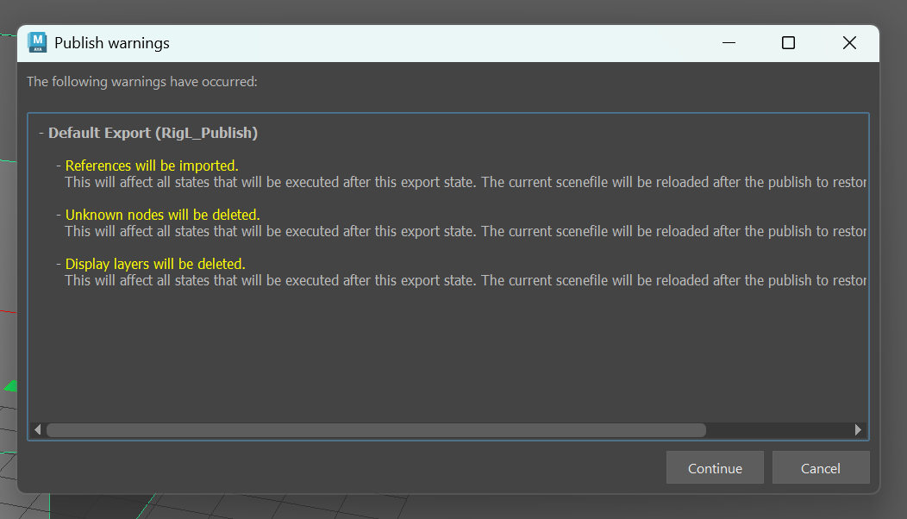
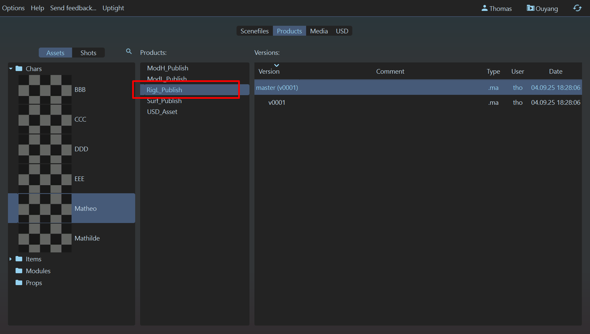

# :material-skull: Rigging Low

{width=40px}
<br>
==Travail à l'asset==

-----

## :material-information-slab-box-outline: Description

Le `Rig Low` consiste a créer des rigs simplifiés pour les modèles 3D basiques créés dans le département [`Modeling Low`](../ModelingLow). Ces rigs sont utilisés pour positionner et animer les modèles dans des le [`Rough Layout`](../RLO) et ne servirons que de référence pour l'animation.

Ces rigs n'apparaitrons pas au rendu, ils peuvent donc etre simplifiés et ne pas contenir toutes les fonctionnalités d'un rig final.

Il n'est pas possible d'avoir de systemes de variants pour un rig low ou high. Un asset ne peux contenir qu'un seul rig. Si vous avez besoin de plusieurs rigs, il faut créer plusieurs assets (exemple : une voiture, si vous avez plusieurs modeles de voitures, il faut créer un asset par modele. Il est cependant possible de créer des variations de texture.)

Pour le rig de personnages, je conseille vivement d'utiliser un **autorig** pour se simplifier la vie et etre plus efficace.

!!! note
    Les rigs ne se font que dans maya, car l'animation ne se fait que dans maya. Si vous voullez faire un rig dans houdini, il faudra le faire au niveau des FX.

-----

## :material-import: Qu'est ce qui rentre ?

Le `Rigging Low` reçoit en entrée le fichier `.usd` produit par le `Modeling Low`, qui normalement, ne contiens que de la géométrie. Il ne supporte qu'une géometrie a la fois.

-----

## :material-export: Qu'est ce qui sort ?

Le `Rigging Low` produit en sortie un fichier `.ma` pret à être utilisé dans le `Rough Layout`.

-----

## {width=30px} Comment créer une scène dans Maya


1. Assurez-vous d'avoir un département de `Rig Low` dans votre asset. Si ce n'est pas le cas, créez-en un.<br>
{width=500px}

2. Créez vous une tache (exemple : `Rigging`). A noter que la nomenclature des taches n'est pas importante pour l'instant, vous pouvez mettre ce que vous voulez.<br>
{width=500px}

3. Click droit sur la partie 'files' (à droite), puis : <br>
`Create Template` -> `Rigging` -> `Maya - Low`, ou simplement sur `Create Template` -> `Auto Maya`<br>
{width=500px}

4. Cela devrait ouvrir une boite de dialogue demandant les paramètres de création de la scène.
    - Le "`Create rigging groups`" détermine si on crée la hierarchie de rigging automatiquement ou pas.
    - Le "`Create Reference`" détermine si on importe des assets ou non.
    - Le "`Import with namespace`" détermine si les assets importés auront un namespace ou non.
    - Le "`Import namespace`" détermine le namespace à utiliser pour les assets importés (par défaut MOD_LOW).
    - Le "`Import method`" détermine le mode d'importation (par exemple, en référence ou en dur).
{width=500px}

5. Notez qu'il y'a une seconde page dans ce dialogue : "`Import Products`". C'est la page qui sert à affiner les products qui seront importées dans la scène au cas ou l'algorithme passe à coté de quelque chose. Ici, on vas importer nos modeling low comme base pour nos rig low.
Lisez la [documentation](https://thomasescalle.github.io/Pipeline_USD_2025/outils/prism_main_pluggin/) pour plus de détails sur cette page.<br>
{width=500px}

6. Cliquez sur le bouton "Create" pour créer la scène.

Cela devrait vous créer un fichier en `.ma`. Double cliquez dessus pour l'ouvrir dans Maya.<br>
Dans maya, il devrait y avoir une hierarchie déja présente, avec les assets importés correctement.


-----

## {width=30px} Comment la scène est t'elle crée ?

La scène crée contiens une hierarchie de Rig comme celle vue en cours. On peu choisir dans les options de création de la scène de la créer automatiquement, ou de créer cette hierarchie par soit meme.

De plus des assets sont importées automatiquement :

- Le `Modeling Low` de l'asset courant. L'algorythme recherche le dernier modeling low publié, dont le format est en .usd. Si il en trouve plusieurs (comme avec des variants), il ne prend que le premier. Je vous conseille donc de bien verifier au moment de la création de la scène que c'est bien le bon modeling low qui est importé. Il detecte les Modeling Low en cherchant les assets qui contiennent "ModL" et "Publish" dans leur nom.

Voici a quoi ressemble une scène de rigging low crée automatiquement :<br>
```
char_<assetName>_rigl_grp
├── char_<assetName>_rigl_geo
│    └── # Geometrie importée du Modeling Low #
├── GlobalMove_01
│    ├── Joints_01
│    ├── CTRLs_01
│    └── IKs_01
├── RelaySystem_01
└── ExtraNodes_01
     ├── ExtraNodes_To_Show_01
     └── ExtraNodes_To_Hide_01
```

-----


## {width=30px} Comment publier une scène dans Maya

1. Une fois votre rig terminée, assurez-vous tout est propre, sans problèmes.<br>

2. Assurez-vous que tous les objets soit bien hièrarchisés, et bien groupés dans le groupe `[département]_[nom]_rigl_grp`.<br>
{width=500px}

3. Selectionnez le groupe `[département]_[nom]_rigl_grp` dans l'outliner.

4. Ouvrez la fenêtre du pipeline de production et cliquez sur le bouton `Publish`.<br>
{width=500px}

5. Une fenêtre s'ouvre, verifiez bien que le champ `Output Type` est bien sur `.ma`, et que le champ `object` est bien sur le groupe a publier (`[département]_[nom]_rigl_grp`).<br>

6. Cliquez sur le bouton `Add Selected` <br>

7. Cliquez sur le bouton `Export` pour publier votre fichier.<br>
{width=500px}

8. Une fenetre vous demandans si vous etes d'accord pour importer les références et cleaner la scène peut s'ouvrir. Cliquez sur `Continue`.<br>
{width=500px}

9. Vous devriez voir un message de succès qui s'affiche. Le rig est maintenant publié sous le nom "RigL_Publish".<br>
{width=500px}
