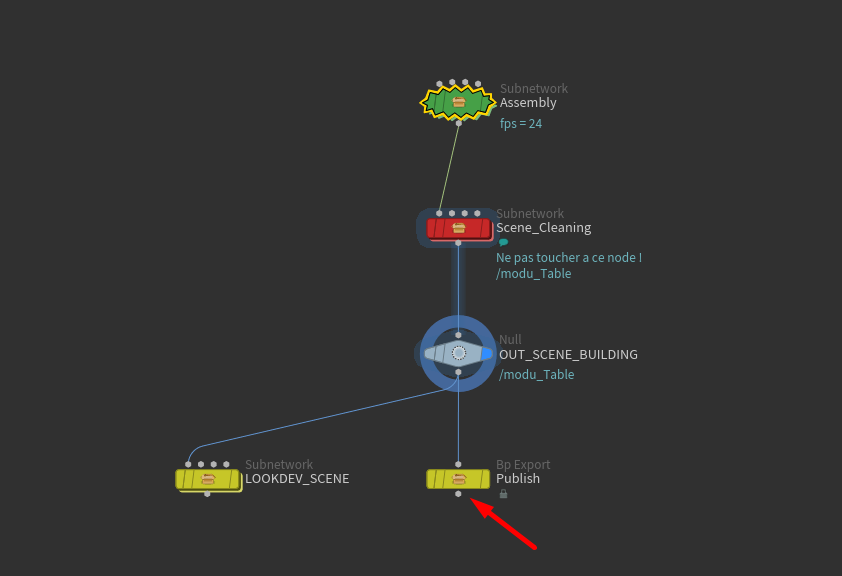

# :material-animation: Set Dress

{width=40px}
 
==Travail au shot==

------

## :material-information-slab-box-outline: Description

Le département `SetDress` est chargé de créer l'assemblage final d'une scène pour une séquence spécifique. Un SetDress correspond à la composition complète d'un environnement pour un shot, incluant l'agencement de tous les éléments nécessaires : décors, accessoires, modules, et autres assets statiques.

Contrairement aux `Modules` qui sont des assemblages réutilisables d'assets, le SetDress est spécifique à une séquence et optimisé pour les besoins particuliers du shot. Il peut incorporer des modules existants, des assets individuels, et organiser l'ensemble de manière cohérente pour la production.

Un SetDress peut contenir des références vers des fichiers `.usd` d'items et de modules. Il représente l'état final de l'environnement avant l'animation et l'éclairage.

Le SetDress sera utilisé par les départements suivants :

- RLO, FLO , Animation comme décor de fond
- Master Lighting et Lighting
- Assembly pour l'assemblage final

------

## :material-import: Qu'est ce qui rentre ?

Un SetDress peut recevoir en entrée plusieurs types de fichiers `.usd` :

- Des modules préalablement créés
- Des items statiques

Cependant, aucun asset n'est importé par défaut par l'algorithme de création de scène. Il est de la responsabilité de l'artiste de sélectionner et d'importer les éléments nécessaires pour composer l'environnement du shot selon les besoins de la séquence.

------

## :material-export: Qu'est ce qui sort ?

Un SetDress génère un fichier `.usd` qui référence tous les assets, modules et éléments d'environnement organisés par l'artiste pour la séquence. 

------

## {width=30px} Comment créer une scène dans Houdini

1. Assurez-vous d'avoir un département de `Set Dress` dans votre master sequence. Si ce n'est pas le cas, créez-en un. 
{width=500px}

2. Créez vous une tache (exemple : `SetDress`). A noter que la nomenclature des taches n'est pas importante pour l'instant, vous pouvez mettre ce que vous voulez. 
{width=500px}

3. Click droit sur la partie 'files' (à droite), puis :  
`Create Template` -> `Set Dress` -> `Houdini`, ou simplement sur `Create Template` -> `Auto Houdini` 
{width=500px}

Cela devrait vous créer un fichier en `.hip`. Double cliquez dessus pour l'ouvrir dans Houdini. 
Dans Houdini, il devrait y avoir une hierarchie déja présente. Rendez vous dans le contexte `stage` pour accéder à la scène. 

{width=500px}

-----

## {width=30px} Comment la scène est t'elle crée ?

La scène créée ne contient pas d'assets importés par défaut. Il est de la responsabilité de l'artiste de sélectionner et d'importer les modules, assets et éléments d'environnement nécessaires pour composer le SetDress de la séquence.

La scène contient le nécessaire pour créer un SetDress, le nettoyer, et le publier / exporter.

Le nettoyage automatique du SetDress consiste à grouper tous les elements sous un groupe parent. Il n'est donc pas nécessaire de trop se soucier de la hiérarchie au moment du placement des assets.

-----

## {width=30px} Ou construire le setDress dans Houdini ?

1. Dans Houdini, rendez vous dans le contexte `stage`. 
{width=500px}

2. A l'interieur, double cliquez sur le node vert `Assembly` pour entrer à l'intérieur. 
{width=500px}

3. Vous pouvez maintenant construire votre module à l'intérieur de ce node, à votre guise. 
{width=500px}

-----

## {width=30px} Comment publier une scène dans Houdini

1. Dans Houdini, rendez vous dans le contexte `stage`. 
{width=500px}

2. Cliquez sur le node jaune `Publish` pour le sélectionner. 
{width=500px}

3. Cliquez sur le bouton `Save to disk` dans le panneau de droite. 
{width=500px}