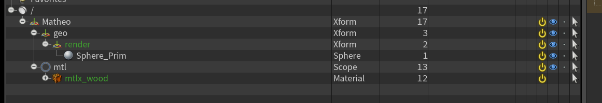

# :material-format-paint: Surfacing

{width=40px}
 
==Travail à l'asset==

------

## :material-information-slab-box-outline: Description

Le département `Surfacing` est responsable de la création et de l'application des shaders sur les modèles 3D.

Ce qui sors du département Surfacing est un fichier `.usd` contenant les **matériaux** et les **assignations des matériaux aux géométries**. Les textures et autres resources doivent etre référencées dans le shader.

L'artiste peut créer des matériaux procéduraux, ou utiliser des textures 2D. Si il souhaite créer ses textures, il peut créer une `task` pour le `texturing` dans le département `Surfacing`.

Il est possible de créer des variants de materiaux pour un meme asset.

------

## :material-import: Qu'est ce qui rentre ?

Le département Surfacing reçoit en entrée des fichiers `.usd` contenant les modèles 3D high (`Modeling High`) (items, personnages, véhicules, etc.) sur lesquels les matériaux seront appliqués.

-----

## :material-export: Qu'est ce qui sort ?

Le département Surfacing génère un fichier `.usd` qui contiens les materiaux et les assignations des matériaux aux géométries.

------

## {width=30px} Comment créer une scène dans Houdini

1. Assurez-vous d'avoir un département de `Surfacing` dans votre asset. Si ce n'est pas le cas, créez-en un. 
{width=500px}

2. Créez vous une tache (exemple : `Surfacing`, ou `Lookdev`). A noter que la nomenclature des taches n'est pas importante pour l'instant, vous pouvez mettre ce que vous voulez. 
{width=500px}

3. Click droit sur la partie 'files' (à droite), puis :  
`Create Template` -> `Lookdev` -> `Houdini`, ou simplement sur `Create Template` -> `Auto Houdini` 
{width=500px}

4. Cela devrait ouvrir une boite de dialogue demandant les paramètres de création de la scène.
    - Le "`Creation Method`" détermine si le nombre d'asset a créer dépends du nombre d'assets a importer, ou si on crée un nombre fixe d'assets grace au paramètre "Number of output groups". Si l'on met "Number of output groups", les assets ne sont pas importées automatiquement, car le nombre d'assets importées peut etre different du nombre d'assets à créer.
    - Le "`Number of output groups`" correspond au nombre d'assets qui sont crées dans la scènes, et donc au nombre de variations qui seront générées si le paramètre "Creation Method" est sur "Number of output groups".
    - Le paramètre "`Variants share the same materials`" détermine si les variations de l'asset partagent les mêmes matériaux, ou si chaque variation a son propre matériau.
    - Le "`Import References`" détermine si on importe des assets ou non.
{width=500px}

5. Notez qu'il y'a une seconde page dans ce dialogue : "`Import Products`". C'est la page qui sert à affiner les products qui seront importées dans la scène au cas ou l'algorithme passe à coté de quelque chose. Ici, on vas importer nos modeling high comme base pour notre surfacing.
Lisez la [documentation](https://thomasescalle.github.io/Pipeline_USD_2025/outils/prism_main_pluggin/) pour plus de détails sur cette page. 
{width=500px}

6. Une fois remplie, cliquez sur `Create`.

Cela devrait vous créer un fichier en `.hip`. Double cliquez dessus pour l'ouvrir dans Houdini. 
Rendez vous dans le network `/stage` pour voir la scène. 
Vous devriez voir une hierarchie déja présente. Celle-ci dépends des assets importés et de la manière dont ils ont été configurés dans la scène. 

{width=500px}

------

## {width=30px} Comment la scène est t'elle crée ?

La scène créée contient le nécessaire pour créer des matériaux, les assigner aux géométries, nétoyer l'ensemble, et publier / exporter.

De plus des éléments sont importées automatiquement :

- Le `Modeling High` de l'asset courant. L'algorythme recherche les modeling High publié, dont le format est en .usd. Si il en trouve plusieurs, la scène contiendra plusieurs groupes, permettant de créer autant de matériaux qu'il ya de géométries. Il detecte les Modeling High en cherchant les assets qui contiennent "ModH" et "Publish" dans leur nom.

Il y'a **3 configurations possible pour la scène** :

1. **Une seule géométrie importée** : 
   Si un seul modeling high est importé, la scène contiendra un seul groupe, et donc un seul matériau à créer. Dans ce cas, le product crée s'appellera "`Surf_Publish`". 
   {width=500px}

2. **Plusieurs assets importés, et plusieurs matériaux à créer** : 
   Si plusieurs modeling high sont importés (ou crées manuèlement), la scène contiendra plusieurs groupes, et donc plusieurs matériaux à créer. Dans ce cas, les produits créés s'appelleront "`Surf_Publish_var001`", "`Surf_Publish_var002`", etc. 
   {width=500px}  
   Dans ce cas, chaque interieur de groupe ressemble à ça : 
   {width=500px}

3. **Plusieurs assets importés, mais un seul matériau à créer** : 
   Si plusieurs modeling high sont importés (ou crées manuèlement), mais que le paramètre "`Variants share the same materials`" est coché, la scène contiendra plusieurs groupes, mais un seul matériau à créer. Dans ce cas, le product crée s'appellera "`Surf_Publish`". 
   {width=500px}

------

## {width=30px} Comment créer un matériau ?

1. Dans Houdini, double-cliquez sur le node vert `Materials` pour entrer dans le network des matériaux. 
{width=500px}

2. Pour créer un material,  `clic droit` -> `selectionner le materiau voulu`, ou `Tab` -> `taper le nom du matériau voulu`. Vous pouvez filtrer en cherchant `Builder` pour trouver des matériaux builder en fonction du moteur de rendu voulu (exemple : `Karma Material Builder`, ou `USD MaterialX Builder`). 
{width=500px}

3. Renommez le material en fonction de ce qu'il représente en cliquant sur le nom du node(exemple : `Mtlx_Wood_Material`, ou `mtlx_Car_Paint_Material`).Puis double cliquez sur le node pour rentrer dedans. 
{width=500px}

4. A l'interieur du material, vous pouvez créer votre shader en utilisant les nodes disponibles dans Houdini. Vous pouvez utiliser des textures 2D, ou créer des matériaux procéduraux. 
{width=500px}

5. Voici un exemple de shader simple utilisant des textures 2D. C'est plus ou moins le même principe que l'hypershade dans maya. 
{width=500px}

------

## {width=30px} Comment assigner un matériau à une géométrie ?

1. Une fois le matériau crée, et l'ensemble correctement nommé, retournez dans le network `/stage`. Puis, selectionnez le node vert `Materials` (ne rentrez pas dedans, nous allons modifier ses paramètres). 
{width=500px} 
{width=500px}

2. Nous allons "exposer" le materiau que nous avons crée, afin de lui donner un chemin et une existance dans l'USD (pour l'instant, il existe aux yeux d'houdini, mais il n'est pas encore dans l'USD). 

3. Dans le panneau d'attribute editor, cliquez sur le bouton `Autofill Materials`. 
{width=500px}

4. Cela devrait remplir automatiquement un nouveau material dans la liste en dessous.  
:material-information-outline: Le champ `Material VOP` correspond au lien du material que vous avez crée relatif au node `Materials`. Vus que nous avons crée ce node a la racine du node `Materials`, le lien est simplement le nom que vous avez donné au material. 
:material-information-outline: Le champ `Material Path` correspond au chemin dans l'USD. C'est ce chemin qui sera utilisé pour assigner le matériau à une géométrie.  
{width=500px}

5. Enlevez de la chaine de charactère le préfixe `materials/` du champ `Material Path`, afin de ne garder que le nom du matériau. (exemple : `Mtlx_Wood_Material` au lieu de `materials/Mtlx_Wood_Material`). 
{width=500px}

6. Si on inspecte le geometry spreadsheet, on peut voir que le materiau s'est bien mis dans le groupe `mtl` à l'interieur de l'asset USD. C'est ce que l'on cherche.
 
{width=500px}

7. A présent, nous allons assigner le matériau à une géométrie. Pour cela, selectionnez le node vert `Assign Material` (ne rentrez pas dedans, nous allons modifier ses paramètres). 
{width=500px}

8. Il nous faut drag&drop le materiau créé dans le champ `Material Path` du node `Assign Material`. 
Puis, drag&drop le groupe (ou la géométrie) à laquelle vous voulez assigner le matériau dans le champ `Primitives`. 
Si vous mettez un groupe, vous pouvez terminer la chaine de charactère par `/*` pour assigner le matériau à toutes les sous géométries du groupe. 
{width=500px}

9. Le materiau est à présent assigné à la géométrie. Vous pouvez le vérifier en inspectant le viewer. 
{width=500px}

!!! note
    Le faire pour la première fois est assez long et peu paretre compliqué, mais une fois que l'on a compris le principe, c'est assez rapide. Courage !

    Si on résume les étapes :
    
    1. Créer un matériau dans le node `Materials`.
    2. Exposer le matériau dans le node `Materials`.
    3. Assigner le matériau à une géométrie dans le node `Assign Material`.

------

## {width=30px} Comment publier une scène dans Houdini

1. Dans Houdini, rendez vous dans le contexte `stage`. 
{width=500px}

2. En fonction de votre configuration (voir plus haut), rentrez dans un groupe (cyan), ou restez dans le network `/stage` (si pas groupe). 
{width=500px}  
{width=500px}

3. Cliquez sur le node jaune `Publish` pour le sélectionner. 
{width=500px}

4. Dans le panneau de droite, cliquez sur le bouton `Save to disk`. 
{width=500px}

Vous devriez à présent avoir un product `Surf_Publish` (ou plusieurs `Surf_Publish_varXXX` en fonction de votre configuration) dans le format .usd . 
{width=500px}