# USD Asset Resolver

## 🌐 Qu'est-ce qu'un *Asset Resolver* USD ?


Dans le système **USD**, un *Asset Resolver* est un composant responsable de **traduire un identifiant logique (URI)** vers un **chemin de fichier concret** dans le système de fichiers ou sur un serveur distant.  

Autrement dit, c’est un **intermédiaire** entre les fichiers USD et la façon dont ils sont stockés dans votre pipeline. Ce procéssus est fait automatiquement par USD.

``` mermaid
flowchart LR
    A["URI logique<br>bp://Uptight?type=c&name=Vinnie"] --> B["Résolution de l'URI"]
    B --> C["Chemin absolu : <br>D:/Projects/.../asset.usda"]
```



{width=200px}

### 💡 Exemple d’utilisation dans Houdini :

Dans un Sublayer ou un Reference, au lieu d’un chemin absolu classique, tu peux directement écrire :

```
bp://Uptight?type=chars&name=Vinnie&product=ModL_Publish&version=latest
```

USD appellera automatiquement ton Asset Resolver pour trouver le bon fichier, et l'afficher.

```
D:/Projects/Uptight/03_Production/01_Assets/Chars/Vinnie/Export/ModL_Publish/v0015/ModL_Publish_v0015.usd
```


---

## 🎯 Pourquoi est-ce utile ?

Un *Asset Resolver* permet de :

- **Éviter les problèmes de verrouillage inter-départements**🔒❤️ :
Dans un pipeline classique, les assets sont souvent référencés via des chemins absolus pointant vers un fichier master unique.
Lorsqu’un artiste d’un département (ex. lookdev ou animation) ouvre une scène qui référence ce fichier, celui-ci devient verrouillé sur le réseau, empêchant d’autres équipes — par exemple modé ou rig — de publier une nouvelle version.
Avec le système d’URI, chaque référence USD pointe vers une version figée (v0003, v0004, etc.) ou un identifiant logique (latest).
Ainsi, publier une nouvelle version ne bloque personne : le fichier précédent reste accessible et la scène d’un artiste plus haut dans le pipeline se mettra simplement à jour automatiquement au prochain rafraîchissement.
- **Décorréler la structure du pipeline** (noms de projets, assets, versions, produits...) de l’arborescence réelle du disque.
- **Garantir la portabilité** : les fichiers USD peuvent être déplacés ou publiés sans casser les liens.
- **Centraliser la logique de résolution** : un seul système gère comment trouver les ressources (assets, shots, versions...)
- **Assurer la cohérence** : tous les logiciels utilisant USD (Houdini, Maya, USDView...) accèdent aux fichiers via le même schéma.


### Exemple de problème sans resolver  

``` mermaid
sequenceDiagram
    autonumber
    participant Mod as 🧱 Modé
    participant Light as 💡 Light
    participant FS as 💾 Fichier master (AssetMaster.usd)

    Mod->>+FS: Écrit et publie le modèle dans le fichier master
    Light->>FS: Référence absolue vers AssetMaster.usd<br/>🔒 Fichier verrouillé
    Mod-->>FS: ⛔ Impossible de publier une nouvelle version

    Note over Mod,Light: Le fichier master est partagé.<br/>Si Light ouvre la scène,<br> Modé ne peut plus publier.<br/>➡️ Blocage du pipeline (locking).
```


### Exemple avec le USD Asset Resolver

``` mermaid
sequenceDiagram
    autonumber
    participant Mod as 🧱 Modé
    participant Light as 💡 Light
    participant Resolver as 🧭 USD Asset Resolver

    Mod->>+Resolver: Publie `Vinnie` → v0003
    Light->>Resolver: Référence `bp://Uptight?...&version=latest`
    Resolver-->>Light: Résout vers v0003
    Mod->>Resolver: Publie nouvelle version → v0004
    Resolver-->>Light: Au prochain refresh,<br/>`latest` → v0004 automatiquement

    Note over Mod,Light: Plus de fichier partagé / verrou.<br/>Chaque version est indépendante.<br/>Light charge toujours la<br> dernière version validée 🔓.

```



----

## 🔗 Qu'est-ce qu'une URI dans ce système ?

Une **URI (Uniform Resource Identifier)** est une chaîne de caractères qui identifie un asset de manière logique, indépendante du système de fichiers.

Exemple :
```text
bp://Uptight?type=Chars&name=Vinnie
```

Cette URI décrit l’asset « Vinnie » du type « Chars » dans le projet « Uptight ».  
Le resolver traduit ensuite cela en un chemin absolu :
```text
D:/Projects/Uptight/03_Production/01_Assets/Chars/Vinnie/Export/USD_Asset/asset.usda
```

---

## 📋 Structure des URIs

Ce système utilise des URIs avec le schéma `bp://` suivant cette structure :

```text
bp://<project>?<parameters>
```

### Schéma de l'URI

| Composant | Description | Obligatoire | Exemple |
|-----------|-------------|-------------|---------|
| `bp://` | Schéma URI identifiant le resolver | ✅ Oui | `bp://` |
| `<project>` | Nom du projet | ✅ Oui | `MyProject` |
| `?` | Séparateur de paramètres | ✅ Oui | `?` |
| `<parameters>` | Paramètres de requête | ✅ Oui | `type=asset&name=character` |

---

## ⚙️ Paramètres de requête

### Paramètres généraux

| Paramètre | Alias | Description | Obligatoire | Valeur par défaut | Exemple |
|-----------|--------|-------------|-------------|-------------------|---------|
| `type` | `t` | Type d'asset | ❌ Non | `Asset` | `type=chars` |
| `product` | `p` | Type de produit/export | ❌ Non | `USD_Asset` | `product=USD_Asset` |
| `version` | `v` | Version spécifique | ❌ Non | `latest` | `version=v001` |

### Paramètres pour les Plans (Shots)

| Paramètre | Alias | Description | Obligatoire | Exemple |
|-----------|--------|-------------|-------------|---------|
| `seq` | `s`, `sequence`, `seqs` | Nom de la séquence | ✅ Oui | `seq=sq010` |
| `shot` | `sh`, `sht`, `shots`, `shts` | Nom du shot | ❌ Non | `shot=sh010` |

### Paramètres pour les Assets

| Paramètre | Alias | Description | Obligatoire | Exemple |
|-----------|--------|-------------|-------------|---------|
| `name` | `n` | Nom de l'asset | ✅ Oui (pour assets) | `name=hero_character` |

---

## 📦 Types d'assets supportés

### Assets

| Type | Alias | Description | Dossier cible |
|------|-------|-------------|---------------|
| `chars` | `c`, `char` | Personnages | `01_Assets/Chars/` |
| `props` | `p`, `prop` | Props/Objets | `01_Assets/Props/` |
| `enviros` | `e`, `env`, `envs` | Environnements | `01_Assets/Enviros/` |
| `items` | `i`, `item` | Items/Éléments | `01_Assets/Items/` |
| `modules` | `m`, `module` | Modules | `01_Assets/Modules/` |
| `asset` | `a`, `assets` | Asset générique | `01_Assets/` |

### Shots

| Type | Alias | Description | Dossier cible |
|------|-------|-------------|---------------|
| `shot` | `s`, `shots` | Plan/Shot | `02_Shots/` |

---

## ⚙️ Configuration

La configuration des projets se fait via le fichier `projects.json`. Celui ci n'est chargé qu'une seule fois au démarrage du resolver (démarrage de Maya, Houdini, USDView...). Pour les gens présents a l'esma montpellier, ce fichier sera situé dans Minerva, dont accecible via le réseau par tous les postes.

```json
{
    "projects": [
        {
            "name": "MyProject",
            "root": "/path/to/project/root"
        },
        {
            "name": "AnotherProject", 
            "root": "/path/to/another/project"
        }
    ]
}
```

---

## 📝 Exemples d'URIs

### Assets de base

```bash
# Récupérer l'asset usd d'un personnage (dernière version)
bp://MyProject?type=chars&name=hero_character

# Version spécifique d'un prop
bp://MyProject?type=props&name=magic_sword&product=ModL_Publish&version=v002

# Environnement avec produit spécifique
bp://MyProject?type=enviros&name=forest_temple&product=ModL_Publish&version=latest
```

### Shots

```bash
# Shot spécifique avec produit
bp://MyProject?type=shot&seq=sq010&shot=sh020&product=Anim_Char_Vinnie_Publish

# Shot master d'une séquence
bp://MyProject?type=shot&seq=sq010&product=Anim_Char_Vinnie_Publish

# Avec version spécifique
bp://MyProject?type=shot&seq=sq010&shot=sh020&product=Anim_Char_Vinnie_Publish&version=v005
```

### Syntaxe raccourcie avec alias

```bash
# Utilisation des alias pour une syntaxe plus courte
bp://MyProject?t=c&n=hero_character&v=latest
bp://MyProject?t=p&n=magic_sword&p=USD_Asset
bp://MyProject?t=s&s=sq010&sh=sh020&p=USD_Layout
```

---

## 🔧 Comment est-il installé ?

Pour l'instant, le resolver n'est compilé que pour Maya et Houdini, et uniquement sous Windows.

Les binaires seront déposés sur Minerva afin que chaque poste puisse y accéder.

Ensuite, l’installeur configurera les variables d’environnement nécessaires pour que Maya et Houdini puissent le détecter, via la mise à jour de maya.env et houdini.env.

Les variables d’environnement nécessaires sont :

``` 
USD_ASSET_RESOLVER
PATH
PXR_PLUGINPATH_NAME
PYTHONPATH
```

---

## 🚀 Comment est t'il lancé sur la Farm ?

Lors des rendus sur la farm avec Deadline, il faudra s'assurer que les variables d'environnement nécessaires au resolver soient correctement définies dans le Job et pointent vers Minerva.

Étant donné que le rendu se fait depuis Houdini, celui-ci aura ainsi accès au resolver.

---

## ⚙️ Comment fonctionne ce resolver ?

Le **USD Asset Resolver** agit en plusieurs étapes :

1. **Interprétation de l’URI** : la chaîne `bp://...` est analysée.
2. **Récupération du projet** : le resolver cherche la racine du projet dans le contexte (défini dans `projects.json`).
3. **Détermination du type** : selon le paramètre `type` (ou `t`), le resolver sait s’il s’agit d’un *Asset* ou d’un *Shot*.
4. **Construction du chemin absolu** : le resolver combine le type, le nom, le produit et la version pour retrouver le fichier réel.
5. **Résolution et mise en cache** : une fois le chemin trouvé, il est enregistré pour accélérer les résolutions futures.

---

## 📊 Notes techniques

- **Performance** : Le système met en cache les résolutions pour éviter les accès disque répétés
- **Flexibilité** : Support de multiples aliases pour faciliter l'utilisation

---

!!! tip "Conseil"
    Utilisez toujours `version=latest` en production pour récupérer automatiquement la dernière version approuvée d'un asset.

!!! info "Information"
    Le resolver peut rechercher des assets avec une recherche insensible à la casse jusqu'à 3 niveaux de profondeur dans l'arborescence.


---

## ✅ Conclusion

Le **USD Asset Resolver** offre un moyen puissant, extensible et cohérent pour gérer les ressources USD dans notre pipeline.  
Il permet de découpler la structure logique des assets de leur emplacement physique tout en restant compatible avec les outils USD natifs.