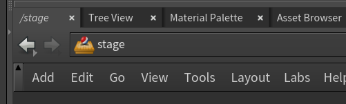

# :material-export: "Bp Asset Reference" Houdini Node

## :material-information: Description

Ce nœud Houdini permet d’**importer des assets USD** directement dans le stage.

C'est une amélioration du nœud standard `Asset Reference` de Houdini, mais qui intègre de façon plus simple le système de variants. 

{width=500px}

## :material-plus-circle: Comment le créer ?

### Méthode 1 : Depuis le menu contextuel

1. Se rendre dans le contexte `/stage` 
{width=500px}

2. Faire un clic droit dans le network editor (ou appuyer sur la touche `Tab`), taper `Bp Asset Reference`, puis appuyer sur `Entrée` pour créer le nœud. 
{width=500px}

### Méthode 2 : Depuis le le Bp Asset Browser

Se référer à la documentation du [Bp Asset Browser](../outils/houdini_window_bp_asset_browser.md) pour plus de détails.

## :material-cog: Paramètres

Les paramètres sont sensiblement semblables à ceux du nœud `Asset Reference` de Houdini, avec quelques ajouts spécifiques au pipeline. [Voir la documentation officielle de Houdini pour plus de détails sur les paramètres standards.](https://www.sidefx.com/docs/houdini/nodes/lop/assetreference.html)

{width=500px}

1. **Reference File** : Le lien vers le fichier USD a référencer. Cliquer sur l'icône de fichier pour ouvrir une boîte de dialogue permettant de sélectionner un asset dans le projet actuel.
2. **Reload File** : Force le rechargement du fichier USD référencé.
3. **Destination Primitive** : Le chemin USD ou l'asset sera stocké dans le stage courant. Par défaut, celui ci est configuré sur `/$OS`, ce qui signifie que l'asset sera stocké dans un prim portant le même nom que le nœud (si le noeud s'appelle `chair1`, l'asset sera stocké dans `/chair1`, a la racine).
4. **Primitive Kind** : Le type de prim a créer dans le stage courant (quel type de groupe). Ce paramètre n'est pas très important dans notre pipeline.
5. **Parent Primitive Kind** : Le type de prim parent a créer dans le stage courant. Par défaut, il est configuré sur `Xform`, ce qui signifie que si le prim parent n'existe pas, il sera créé en tant que `Xform` (c'est un groupe transformable).
6. **Variant Mode** : Permet de choisir comment les variants sont gérés.
    - `Set` : Permet de choisir un variant spécifique dans le nœud.
    - `Explore` : Permet d'explorer les variants disponibles dans le nœud, de les visualiser tous en meme temps.
    - `Duplicate` : Permet de dupliquer le nœud pour chaque variant disponible (utile pour le scattering par exemple).
7. **Transform** : Permet d'appliquer une transformation (translation, rotation, échelle) a l'asset importé.

Il est aussi possible de transformer le noeud directement dans le viewport, en utilisant les outils de transformation standards de Houdini (touche `T` pour la translation, `R` pour la rotation, `E` pour l'échelle).