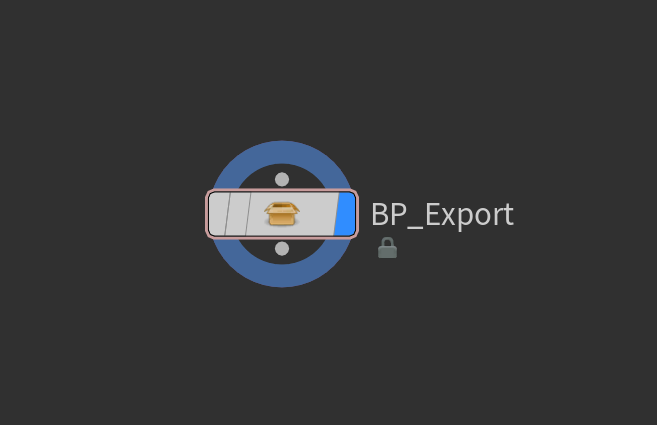
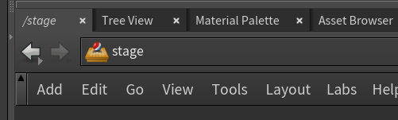
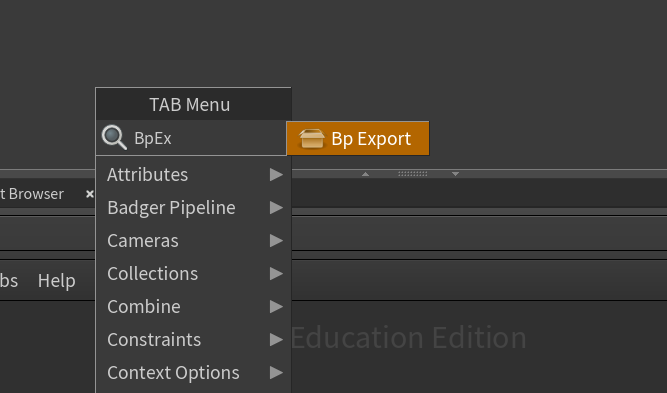
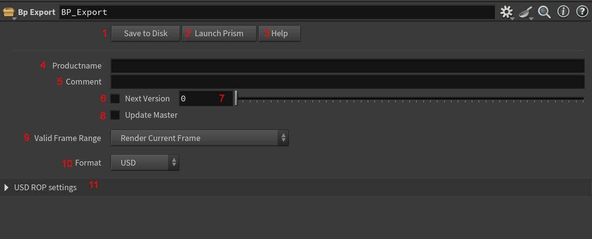

# :material-export: "Bp Export" Houdini Node

## :material-information: Description

Ce nœud Houdini permet d’**exporter des fichiers .usd** depuis le stage, directement dans Prism. Il implémente ainsi le système de produits et de gestion de versions. 
{width=500px}

## :material-plus-circle: Comment le créer ?

1. Se rendre dans le contexte `/stage` 
{width=500px}

2. Faire un clic droit dans le network editor (ou appuyer sur la touche `Tab`), taper `Bp Export`, puis appuyer sur `Entrée` pour créer le nœud. 
{width=500px}

## :material-cog: Paramètres
{width=500px}

1. **Save to Disk** : Exporte le fichier USD dans prism selon les paramètres suivants.
2. **Launch Prism** : Ouvre l'application Prism.
3. **Help** : Ouvre la documentation en ligne de ce nœud (ce document).
4. **Product name** : Nom du produit à créer dans Prism.
5. **Comment** : Commentaire associé à cette version.
6. **Next Version** : Détermine si la version doit être incrémentée automatiquement.
7. **Version** : Version du produit à créer (si `Next Version` est désactivé).
8. **Update Master** : Détermine si on dois mettre à jour le produit master (la dernière version publiée).
9. **Valid Frame Range** : Détermine si on exporte toute la plage de frames ou seulement la frame courante.
10. **Format** : Format d'export (USD, USDA, USDC).
11. **USD ROP Settings** : Paramètres avancés d'export USD ([voir documentation Houdini du USD ROP](https://www.sidefx.com/docs/houdini/nodes/out/usd.html)).