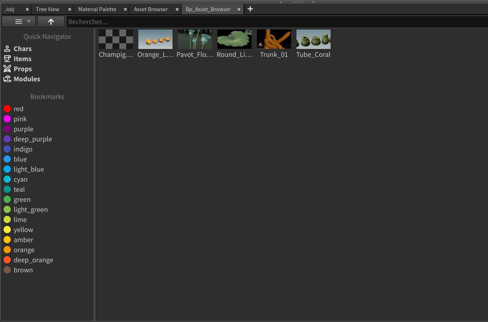
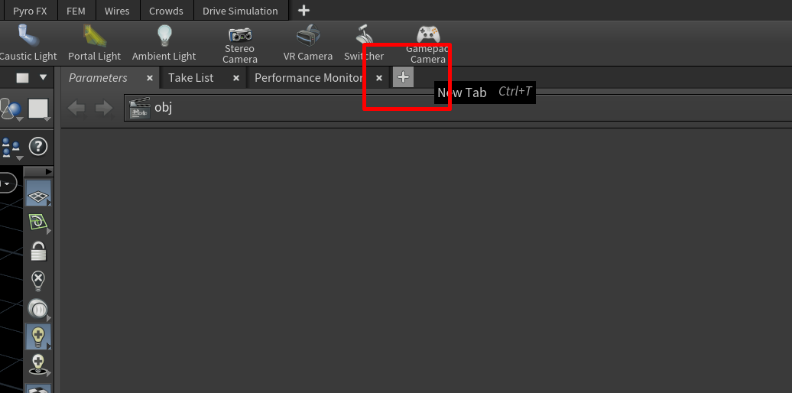
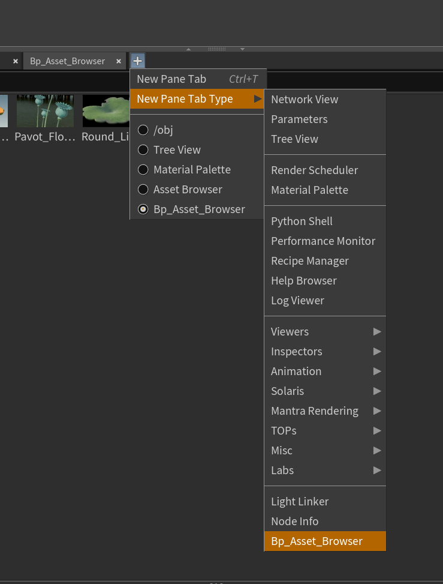
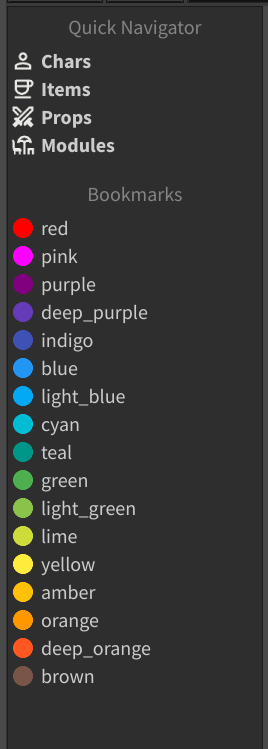
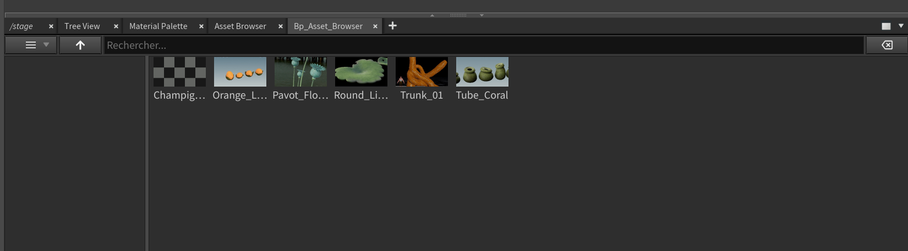
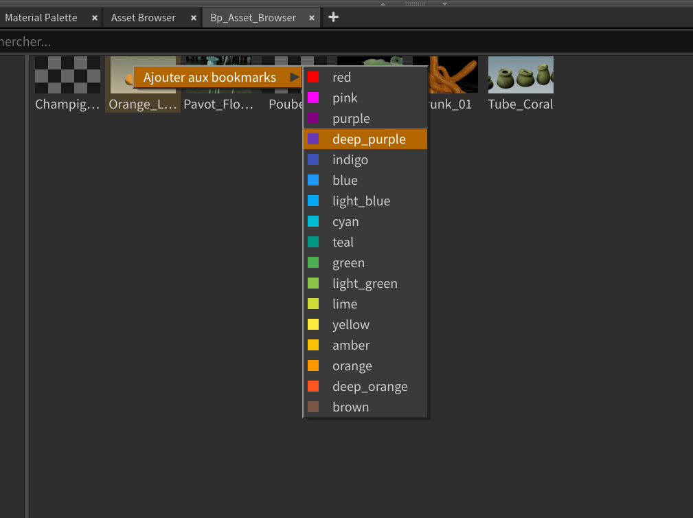
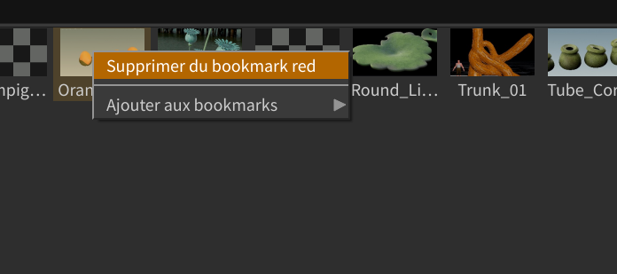
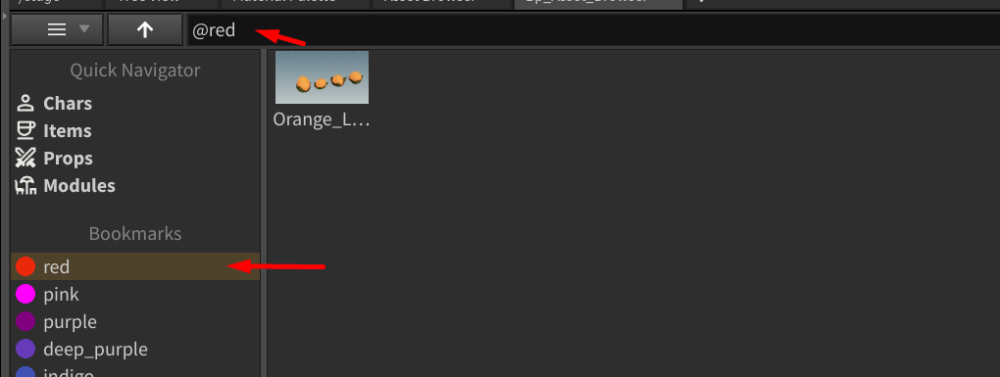
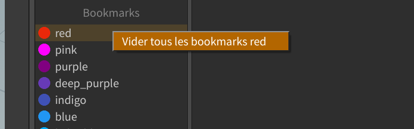

# :material-window-restore: "Bp Asset Browser" Houdini Window

## :material-information: Description

Cette fenêtre Houdini permet de **naviguer dans les assets USD** stockés dans Prism, et de les importer en référence dans la scène Houdini en cours. 

{width=500px}

## :material-plus-circle: Comment l'ouvrir ?
1. Cliquez sur le petit plus en haut a droite des onglets de l'interface Houdini.
{width=500px}

2. Sélectionnez "`Bp_Asset_Browser`" dans la liste. 
{width=500px}

3. La fenêtre s'ouvre et est disponible dans les onglets.

## :material-cog: Organisation de la fenêtre

La fenêtre est divisée en deux parties :

- A gauche, il y'a le `Navigation rapide` qui permet de naviguer rapidement dans les differents types d'assets / les bookmarks.
- A droite, il y'a le `Navigateur principal` qui permet de naviguer dans les assets, de les filtrer, et de les importer en référence dans la scène Houdini en cours.

## :material-star-outline: Navigation rapide

{width=200px}

Il y'a plusieurs sections dans le navigator rapide :

1. **Les types d'assets** : Permet de naviguer entre les `Chars`, `Props`, `Items` et `Modules`.
2. **Les bookmarks** : Permet d'accéder rapidement aux dossiers bookmarkés (option non disponible pour l'instant, a faire plus tard).

Il suffit de cliquer sur un des boutons pour que le navigateur principal affiche les assets correspondants.

## :material-star-outline: Navigateur principal

{width=500px}

Le navigateur principal est la ou s'affichent les assets.
Il se compose de deux parties : 

1. **La barre de recherche et d'outils** : 

    Le premier bouton a partir de la gauche permet de changer de mode d'affichage (liste ou grille). 
    Le second bouton permet de remonter d'un niveau dans l'arborescence des dossiers. 
    Le champ de recherche permet de filtrer les assets par nom. 
    Le dernier bouton permet de néttoyer le champ de recherche.

2. **La liste des assets** :

    C'est ici que s'affichent les dossiers et les assets. 
    - Les dossiers sont représentés par une icône de dossier jaune, il suffit de double cliquer dessus pour les ouvrir. 
    - Les assets sont représentés par une icône, soit une mignature de l'asset, soit une icône générique selon le mode d'affichage choisi. 

    Il suffit de double cliquer sur un asset pour l'importer en référence dans la scène Houdini en cours. 

## :material-wrench-outline: Système de bookmarks

Pour ajouter un item à un **bookmark**, il suffit de faire un clic droit sur le dossier ou l'asset, et de sélectionner `Ajouter au bookmarks`, puis de selectionner la couleur souhaitée. 
{width=500px}

Pour retirer un item d'un bookmark, il suffit de faire un clic droit sur le dossier ou l'asset, et de sélectionner `Enlever du bookmark <couleur>`. 
{width=500px}

Pour accéder aux bookmarks, il suffit de cliquer sur la couleur correspondante dans la navigation rapide, ou de taper le nom de la couleur dans le champ de recherche avec un `@` devant (ex: `@red`). 
{width=500px}

Vous pouvez vider tous les items d'un bookmark en faisant un clic droit sur la couleur dans la navigation rapide, et en sélectionnant `Vider tous les bookmarks <couleur>`. 
{width=500px}