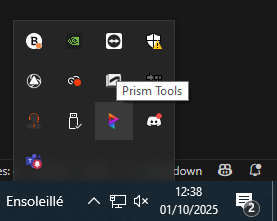
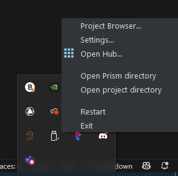
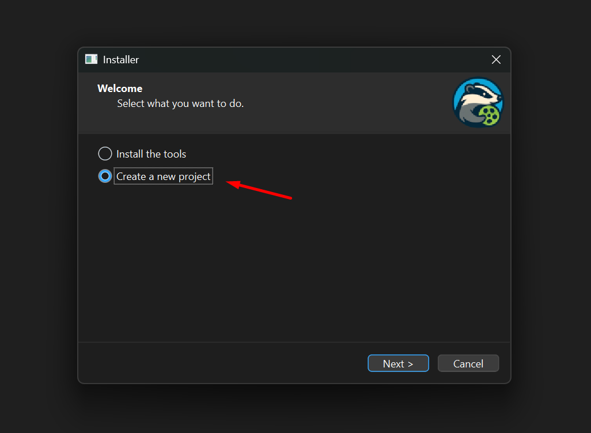
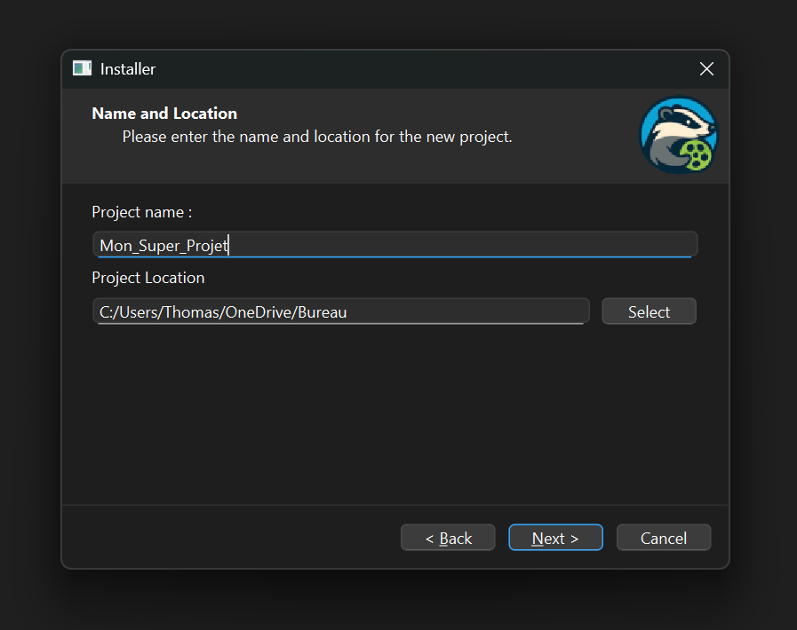
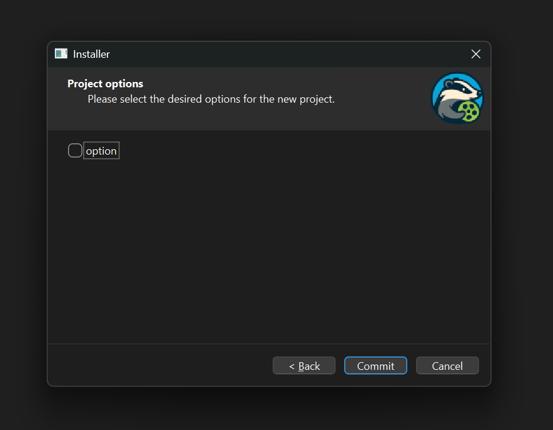
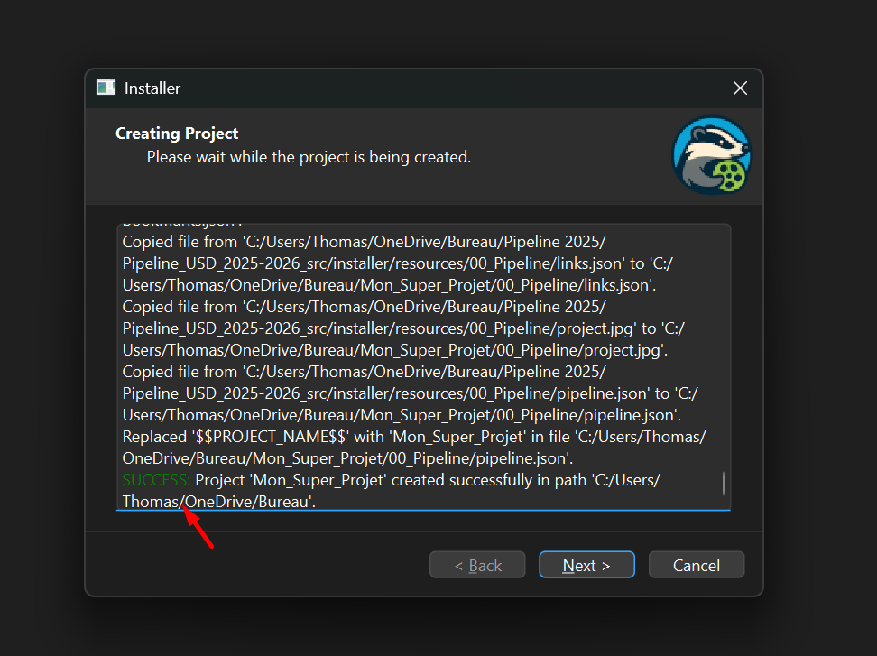
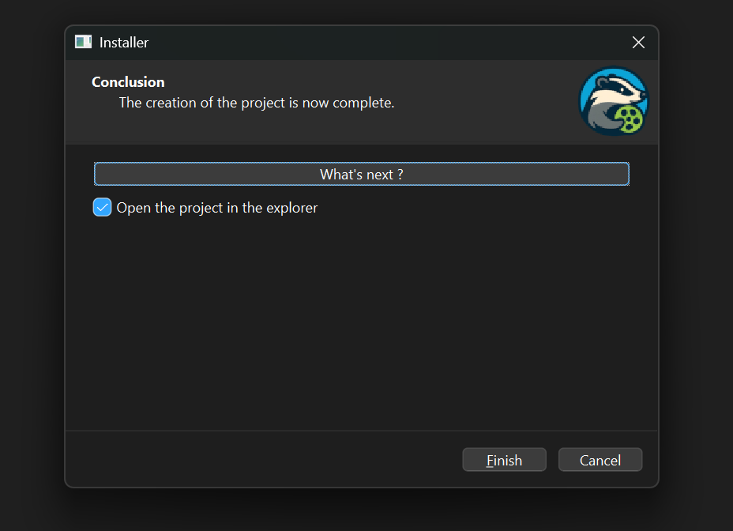

# :material-download: Installeur

J'ai crée un installeur pour faciliter l'installation des differents outils sur votre machine.

Il permet de :

1. Installer les outils
2. Créer un nouveau projet

------

## :material-rocket-launch-outline: Comment lancer l'installeur

Pour lancer l'installeur, il vous faut suivre les étapes suivantes :

1. Ouvrez ce repository github du projet sur votre navigateur : 
[lien du repo github](https://github.com/ThomasEscalle/Pipeline_USD_2025-2026_src/releases)
2. Sélectionner la dernière version, puis dans la partie "`Asset`" cliquez  sur le fichier zip pour le télécharger.

3. Extrayez le contenu du fichier ZIP dans un dossier de votre choix sur votre ordinateur
4. Ouvrez le dossier extrait, puis ouvrez le dossier `installer`, puis le dossier `bin`
5. Double-cliquez sur le fichier `installer.exe` pour lancer l'installeur. Vous arriverez sur une fenêtre comme celle-ci :

!!! warning "Attention"
    L'installeur dépends des autres fichiers dans le repository, il faut donc que vous ayez extrait tout le contenu du ZIP avant de lancer l'installeur. 
    
    Il n'est pas possible de lancer l'installeur directement depuis le ZIP.

    Il n'est donc pas possible de partager que le .exe.

------

## :material-page-next: Utilisation de l'installeur

L'installeur est très simple d'utilisation, il vous suffit de suivre les étapes suivantes :

1. Sur la première page, vous avez deux choix : 
    - [Installer les outils](#installer-les-outils)
    - [Créer un nouveau projet](#creer-un-nouveau-projet)

    Choisissez l'option que vous souhaitez en cliquant sur le bouton correspondant.

------

## :material-tools: Installer les outils

Avec cette option, l'installeur va installer tous les outils nécessaires pour travailler sur vos projets. 
L'installateur ne vas pas chercher les fichiers sur internet. Il vas juste copier les fichiers déjà présents dans le repository la ou il faut.

Voici les étapes à suivre :

1. Cliquez sur le bouton "`Installer les outils`" de la première page. 

------

## :material-tools: Mise à jour des outils

2. Fermez Prism en cliquant sur exit 
{width=310px}
{width=250px}
3. Relancer l'installer comme lors de la [première installation](#comment-lancer-linstalleur)

------

## :material-plus-box-outline: Créer un nouveau projet

Avec cette option, l'installeur va créer un nouveau projet en copiant les fichiers nécessaires depuis le repository. Voici les étapes à suivre :

1. Cliquez sur le bouton "`Create a new project`" de la première page. 
{width=500px}
2. Choisissez un nom pour votre projet, ainsi qu'un emplacement sur votre ordinateur. Puis cliquez sur le bouton "`Next`". 
{width=500px}
3. Choisissez les options de votre projet. Pour l'instant, il n'y en a pas. Peut-être dans le futur. Cliquez sur le bouton "`Commit`". 
{width=500px}
4. Attendez que l'installeur termine la création de votre projet. Le code est telement optimisé que le temps de chargement ne devrait même pas être visible 😎.
    
    A la fin de l'installation, vous devriez voir a la fin du texte "`SUCCESS`" en vert.
    
    Cliquez sur le bouton "`Next`"
     
{width=500px}

5. Le projet est actuellement créé. Vous pouvez cliquer sur le bouton "`Open the project in explorer`" pour ouvrir le dossier de votre projet dans l'explorateur de fichiers.
    
    Cliquez ensuite sur le bouton "`Finish`" pour fermer l'installeur.
     
{width=500px}