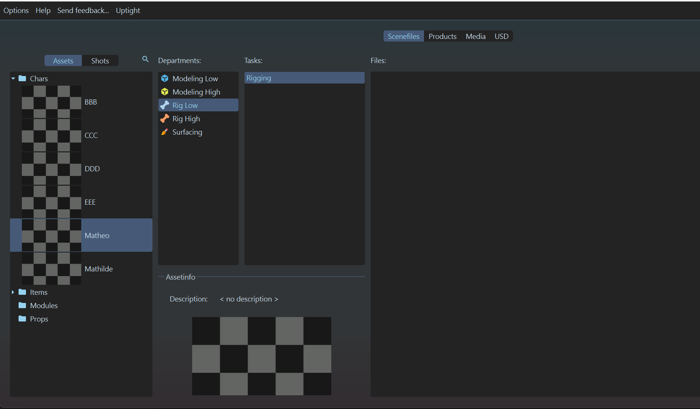

# :material-magic-staff: Maya "**Props Autorig**"

## :material-information: Description

Il s'agit d'une fonction présente dans le [plugin Prism](../prism_main_pluggin) qui permet de générer automatiquement un rig simple pour les props pour maya.

Il crées une scène proceduralement qui :

- Crées une hierarchie de groupe propre
- Importe les assets nécessaires
- Crées des controlleurs en fonction de la taille de l'asset
- Crées les joints, les contraintes et les skinning associés

Il est possible de créer des rigs pour le département [RigLow](../../departements/RiggingLow/) et [RigHigh](../../departements/RiggingHigh/).

## {width=30px} Comment créer une scène dans Maya

1. Assurez vous d'avoir un product a importer dans votre scène (Exemple : une geo low poly pour le département `Modeling Low`, correctement nomé ). 
{width=500px}

2. Assurez-vous aussi d'avoir un département de `Rig Low` (ou `Rig High` si vous voulez rigger un `rig high`) dans votre asset. Si ce n'est pas le cas, créez-en un. 
{width=500px}

3. Créez vous une tache (exemple : `Autorig`). A noter que la nomenclature des taches n'est pas importante pour l'instant, vous pouvez mettre ce que vous voulez. 
{width=500px}

4. Click droit sur la partie 'files' (à droite), puis :  
`Create Template` -> `Rigging` -> `Maya - AutoRig Props Low`, ou `Maya - AutoRig Props High`, en fonction de votre département. 
{width=500px}

5. Cela devrait ouvrir une boite de dialogue demandant les paramètres de création de la scène.
    - Le "`Controller placement`" détermine où seront placés les controlleurs (au centre de la bounding box, , en haut, ou en bas, en fonction de la taille de l'asset). 
{width=500px}

5. Notez qu'il y'a une seconde page dans ce dialogue : "`Import Products`". C'est la page qui sert à affiner les products qui seront importées dans la scène au cas ou l'algorithme passe à coté de quelque chose. Ici, on vas importer nos modeling low comme base pour nos rig low (ou modeling high pour rig high).
Lisez la [documentation](https://thomasescalle.github.io/Pipeline_USD_2025/outils/prism_main_pluggin/) pour plus de détails sur cette page. 
{width=500px}

6. Cliquez sur le bouton "Create" pour créer la scène.

Cela devrait vous créer un fichier en `.ma`. Double cliquez dessus pour l'ouvrir dans Maya. 
Dans maya, il devrait y avoir une hierarchie déja présente, avec les assets importés correctement, et un rig simple mais fonctionnel.  
{width=500px}
