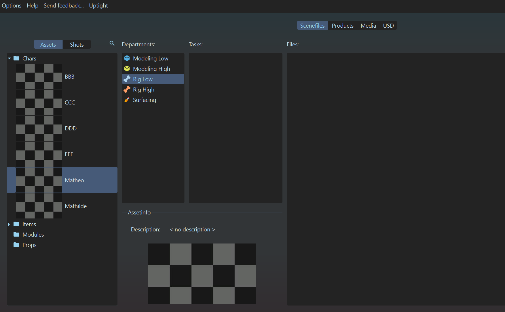

# :material-magic-staff: Maya "**Props Autorig**"

## :material-information: Description

Il s'agit d'une fonction présente dans le [plugin Prism](../prism_main_pluggin) qui permet de générer automatiquement un rig simple pour les props dans Maya.

Elle crée une scène procéduralement qui :

- Génère une hiérarchie de groupes propre
- Importe les assets nécessaires
- Crée des contrôleurs en fonction de la taille de l'asset
- Génère les joints, les contraintes et le skinning associés

Il est possible de créer des rigs pour le département [RigLow](../../departements/RiggingLow/) et [RigHigh](../../departements/RiggingHigh/).

## {width=30px} Comment créer une scène dans Maya

1. Assurez-vous d'avoir un produit à importer dans votre scène (exemple : une géométrie low poly pour le département `Modeling Low`, correctement nommée). 
{width=500px}

2. Assurez-vous également d'avoir un département de `Rig Low` (ou `Rig High` si vous voulez rigger un `rig high`) dans votre asset. Si ce n'est pas le cas, créez-en un. 
{width=500px}

3. Créez une tâche (exemple : `Autorig`). À noter que la nomenclature des tâches n'est pas importante pour l'instant, vous pouvez mettre ce que vous voulez. 
{width=500px}

4. Cliquez droit sur la partie 'files' (à droite), puis :  
`Create Template` -> `Rigging` -> `Maya - AutoRig Props Low`, ou `Maya - AutoRig Props High`, en fonction de votre département. 
{width=500px}

5. Cela devrait ouvrir une boîte de dialogue demandant les paramètres de création de la scène.
    - Le "`Controller placement`" détermine où seront placés les contrôleurs (au centre de la bounding box, en haut, ou en bas, en fonction de la taille de l'asset). 
{width=500px}

6. Notez qu'il y a une seconde page dans ce dialogue : "`Import Products`". Cette page permet d'affiner les produits qui seront importés dans la scène au cas où l'algorithme passerait à côté de quelque chose. Ici, nous allons importer nos modèles low poly comme base pour nos rigs low (ou modèles high poly pour rigs high).
Lisez la [documentation](https://thomasescalle.github.io/Pipeline_USD_2025/outils/prism_main_pluggin/) pour plus de détails sur cette page. 
{width=500px}

7. Cliquez sur le bouton "Create" pour créer la scène.

Cela devrait générer un fichier en `.ma`. Double-cliquez dessus pour l'ouvrir dans Maya. 
Dans Maya, une hiérarchie devrait déjà être présente, avec les assets correctement importés, et un rig simple mais fonctionnel.  
{width=500px}
