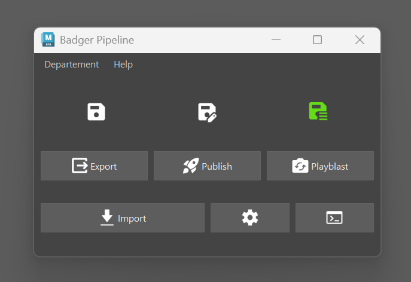
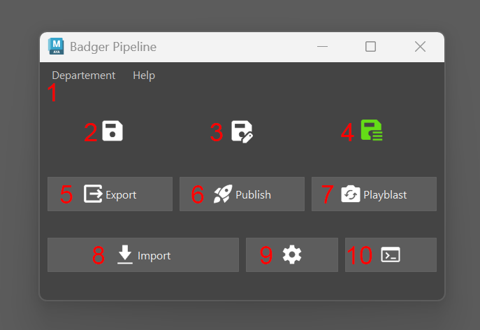

# :material-content-save: Maya "**Save As**" Script

{width=500px}

Ce script maya apporte une nouvelle fenetre dans maya, permettant de faciliter l'enregistrement et l'exportation des fichiers.

## Comment démarrer la fenêtre ?

Pour démarrer la fenêtre, lancez le code suivant dans le script editor, ou dans un shelf.
``` python
from SaveAs.SaveAs import main
main()
```


## Fonctionnalités

{width=500px}

1. Menu **Département** : Ce menu permet de sélectionner le département dans lequel vous souhaitez enregistrer le fichier. Le choix du département détermine le type d’exports et de publish personnalisés. Par défaut, le script détecte automatiquement le département en fonction du nom de la scène lors de l’ouverture de la fenêtre. Toutefois, cette option vous permet de l’ajuster manuellement si nécessaire.
2. Bouton **Enregistrer** : Enregistre la scène Maya (équivalent à un simple `File > Save`).`
3. Bouton **Enregistrer avec versionning** : Enregistre la scène Maya en créant une nouvelle version dans prism.
4. Bouton **Enregistrer avec versionning et commentaires** : Enregistre la scène Maya en créant une nouvelle version dans prism et demandant un commentaire qui s'affichera plus tard dans prism.
5. Bouton **Exporter** : Permet d'exporter la scène et de créer un product. Voir [Difference entre un export et un publish](../../qanda/#quelle-est-la-difference-entre-un-export-et-un-publish).
6. Bouton **Publish** : Permet de publier la scène dans prism.
7. Bouton **Playblast** : Permet de créer un playblast de la scène et de l'enregistrer dans Prism, dans la section "Media".
8. Bouton **Import** : Ouvre une fenetre d'importation pour sélectionner un fichier à importer dans la scène.
9. Bouton **State** : Ouvre le state manager ( [State Manager](https://prism-pipeline.com/docs/latest/general/State%20Manager/))
10. Bouton **Ouvrir Prism** : Ouvre l'application Prism dans maya.