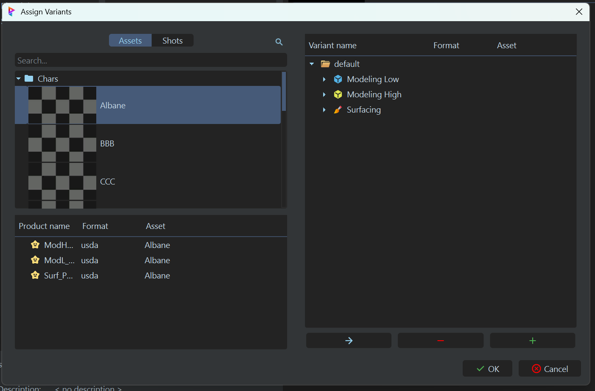
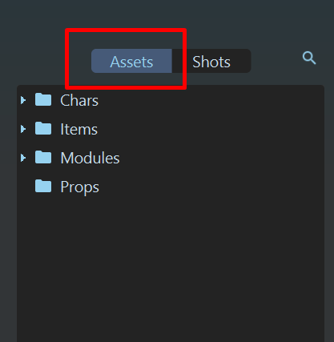
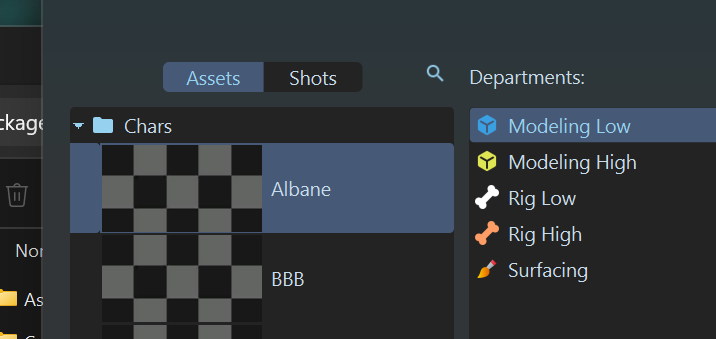
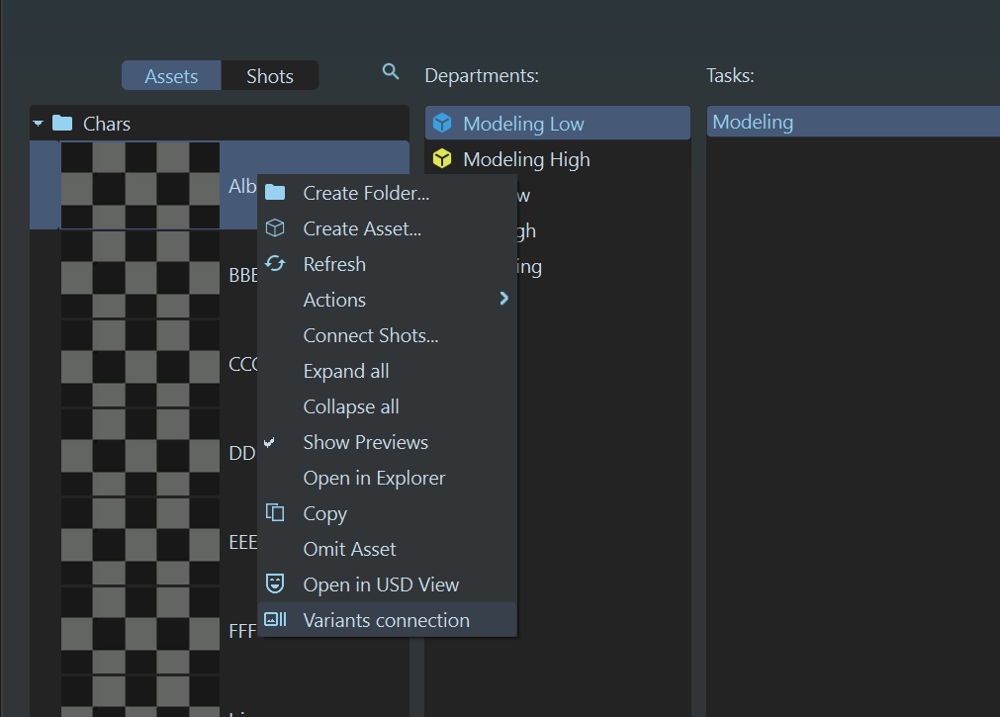
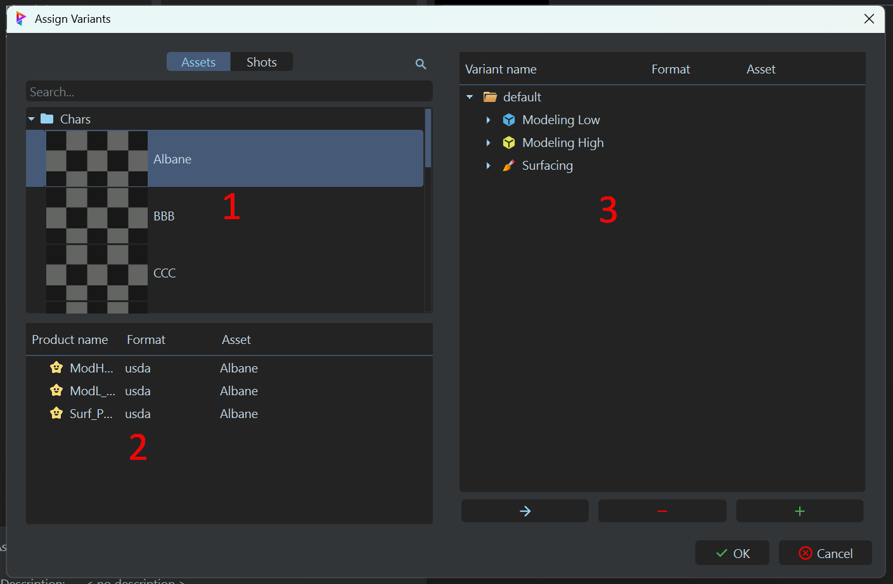

# :material-hexagon-multiple-outline: Système d'édition des variants du plugin Prism

## :material-information: Description

Ce systeme permet de **gérer les variants des assets**, directement depuis Prism.

En gros, ce systèm permet de connecter des `modeles low poly` (proxy), `modeles high poly`,et des `surfacings` et de switcher entre plusieurs variantes de chaque modèle.

Allez lire cette partie de la doc pour comprendre le concept de `variants` : [:material-information-outline:{ .lg .middle } **Concept de variants**](../../qanda/#quest-ce-quun-variant-en-usd)

!!!warning
    Attention : Cette fonctionnalitée n'est disponible que pour les `Items`, `Props` et `Characters`. Pas pour les `Modules`. Peut etre que je me pencherai dessus plus tard.

{width=500px}

## :material-window-open: Comment ouvrir l'interface ?

Pour ouvrir cette interface, il vous faut :

1. Assurez vous de bien etre en mode `Assets` dans Prism. 
{width=500px}

2. Sélectionnez un asset dans la liste des assets.
 
{width=500px}

3. Clic droit sur l'asset, et cliquez sur `Variants connections`. 
{width=500px}

------

## :material-cube-send:{ .lg .middle } Utilisation

Voici comment se présente l'interface : 
{width=500px}

1. **Assets** : Dans cette section, vous pouvez naviguer dans la liste des assets, les filtrer et les selectionner. 

2. **Products** : Ici , vous pouvez voir tous les products de l'asset selectionné. 

3. **Variants** : Dans cette section, vous pouvez voir et éditer les variants de chaque product.
Il s'agis d'une liste de variants. Si vous déroulez un variant, vous pouvez voir que chaque item contients un `model low poly`, un `model high poly` et un `surfacings`. 

------

### :material-plus-circle: Créer un variant    

Pour créer un variant (un groupe), il vous suffit de cliquer sur le bouton `+`, ou simplement de cliquer sur le `+`de votre clavier.

------

### :material-minus-circle: Supprimer un variant

Pour supprimer un variant, il vous suffit de le sélectionner et de cliquer sur le bouton `-`, ou simplement d'appuyer sur la touche `suppr` de votre clavier.

------

### :material-arrow-right: Ajouter un item dans un variant

Pour ajouter un item dans un variant, vous avez plusieurs possibilitées :

1. Selectionnez la destination (model low poly, model high poly ou surfacing), et double cliquez sur un product (la liste en bas a gauche).
2. Drag and drop un product (la liste en bas a gauche) vers la destination (model low poly, model high poly ou surfacing).
3. Selectionnez le variant (le groupe global), et double cliquez sur un product (la liste en bas a gauche). Le systeme va automatiquement ajouter le product dans la destination appropriée grace a la nomenclature du product.

------

###  :material-content-save: Enregistrer les modifications

Une fois que vous avez fait vos modifications, n'oubliez pas de cliquer sur le bouton `Ok` pour enregistrer les modifications. Si vous cliquez sur `Cancel`, toutes vos modifications seront perdues.

------

!!! info "Informations supplémentaires"

    Il n'est pas obligatoire que le product vienne nécessairement de l'asset selectionné. Vous pouvez très bien ajouter un product d'un autre asset.

    Vous pouvez très bien réutiliser le meme product dans plusieurs variants. Par exemple, vous pouvez avoir 2 variants qui utilisent le meme model low poly, mais avec des model high poly et des surfacings différents.

    Il est obligatoire que les 3 elements d'un variant soient remplis (model low poly, model high poly et surfacing). Si un des 3 elements est manquant, la fenêtre de Prism vous le signalera et vous ne pourrez pas enregistrer les modifications.
